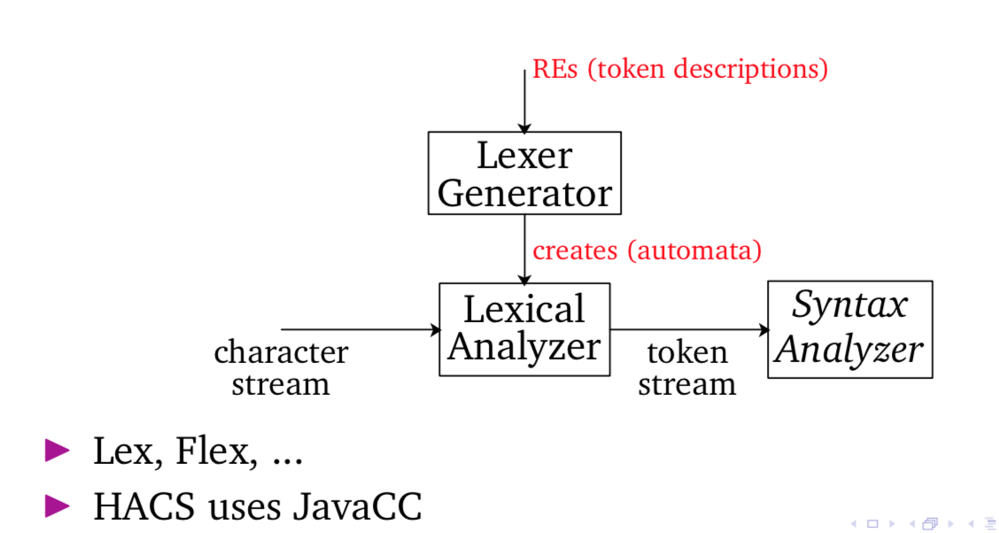

# Flex and Bison Tutorial

## Installation
**Mac:**

If you do not have installed homebrew, please do this following code in your terminal:
```bash
/usr/bin/ruby -e "$(curl -fsSL https://raw.githubusercontent.com/Homebrew/install/master/install)"
```
If you have installed homebrew, do those two commands in your terminal:
```bash
brew install flex # to install flex
brew install bison # to install bison
```
https://ftp.gnu.org/gnu/bison/

**Windows:**

Please find [this page](https://samskalicky.wordpress.com/2014/01/25/tutorial-setting-up-flex-bison-on-windows/) for the tutorial.

**Ubuntu Linux:**

Please find [this page](https://ccm.net/faq/30635-how-to-install-flex-and-bison-under-ubuntu) for the tutorial.

## Lexical analysis
- 
- To specify tokens, we use regular expressions (Regex) to represent some patterns.

### Lexer
- Def. --- A lexer is 

- Overview
<p align="center">

</p>

## Syntax analysis:
**Q:** How to specify language syntax?
  - Context free grammar (CFG), consists of set of rules (productions)
  - Uses special notation to represent (BNF – [Backus Naur Form](https://en.wikipedia.org/wiki/Backus%E2%80%93Naur_form)) 

### Parser
- Def. --- A parser is a component that takes input string or text and builds a parse tree based on the input. 
- There are two kinds of parser: LL and LR (Bison use this type of parser). The main difference between these two is analysis strategy (parsing procedure).
- Consider this grammar as an example:
```
E → E + T | T
T → T ∗ F | F
F → ( E ) | id
Note: E is the root symbol in this grammar.
```
**Q:** How to build a parse tree for parsing such a string contains `id * id`?
Both two strategies will scan a string from left-to-right.

## Flex Scanner (*.l files)
**Skeleton (structure for a flex file):**
``` c++
%{
C/C++ declarations
%}

Flex declarations

%%
Token rules (Regular expression i.e. Regex)
%%
Additional C code
```

**Creating a Regex(regular expression):**

This is the syntax how to design regular expression:
```c++
%%
<regular expression>        { <actions> }
%%
```
For example, suppose you want to create tokens for positive integers and plus sign?
```c++
%%
[1-9]*[0-9]       { return INT; }
"+"               { return PLUS; }
%%
```
## Bison Parser (*.y files)
**Skeleton (structure for a bison file):**
``` c++
%{
C declarations
%}

Bison declarations

%%
Grammar rules (BNF form)
%%

Additional C code
```

**Creating a grammar:**

This is the syntax that generates the grammars and tokens:

``` c++
/****** Start Symbol ****/
%start <start_symbol> /* put start symbol here*/
  /*example*/
%start prog

/****** Token ****/
%token <token_name> <token_name> ...
  /*example*/
%token PLUS NUM

/****** Grammar ****/
%%
  /*example*/
prog :  NUM PLUS NUM /* This is the same as CFG: prog -> NUM + NUM*/                   
     ;
%%
```
Don't forget to put the main function in your parser at the end of the file.

## How to run the program

Make sure you have make.sh, <file_name>.l and <file_name>.y in your folder. Run the following code on the terminal:
```bash
./make.sh <file_name>
./a.out
1 + 3
# click control + D to exit
```

## Sample thoughts to design Regex and Grammar
**Question 1:**

Design a regular expression for a language that accept all strings of lowercase letters containing the five english vowels (a,e,i,o,u) in order and each occurring exactly at once.

For instance, a valid string is:
```
h a b e c i k o u m
```
and an invalid string is:
```
s a a a a b e
```
###### Answer:
The idea to think about this question is designing a pattern to match five signle vowels in the alphabetical order. For example, we can create a format as:
```
?a?e?i?o?u?
```
Let `?` be a character class to match non-vowels: 
```
? = [b-df-hj-np-t-v-z]
```
Then we could generate regex like this:
```
(?*)a(?*)e(?*)i(?*)o(?*)u(?*)
```

**Question 2:**

Design a context-free grammar that accept this language:


###### Answer:
The idea is that the number of occurences of `c` must equal to the sum of the occurences for `a` and `b`. That is, if a string contains `a`, it must also contains either `b` or `c`. Here is one possible solution:
```
S -> aSc | X
X -> aXb | ε
```

## Notes
1. If you plan to learn more about flex and bison, please see [this manual](http://web.iitd.ac.in/~sumeet/flex__bison.pdf).
2. Here is the [website](https://web.stanford.edu/class/archive/cs/cs103/cs103.1156/tools/cfg/) for testing the correctness of CFG.
3. Here is one [website](https://regex101.com/) for testing the correctness of regular expression.
