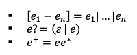
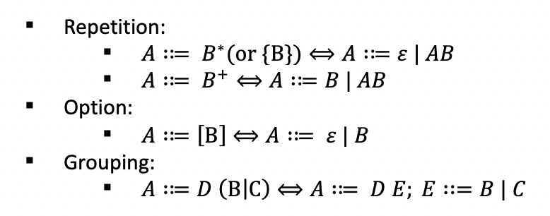
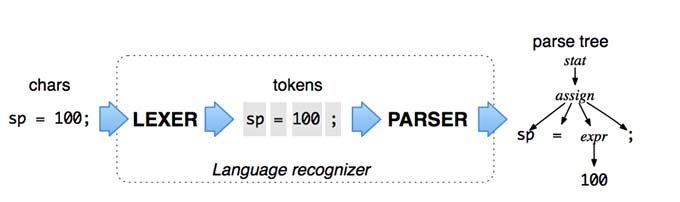

# Flex and Bison Tutorial

## Installation
**Mac:**

If you do not have installed homebrew, please do this following code in your terminal:
```bash
/usr/bin/ruby -e "$(curl -fsSL https://raw.githubusercontent.com/Homebrew/install/master/install)"
```
If you have installed homebrew, do these two commands in your terminal:
```bash
brew install flex # to install flex
brew install bison # to install bison
```

**Windows:**

Please find [this page](https://samskalicky.wordpress.com/2014/01/25/tutorial-setting-up-flex-bison-on-windows/) for the tutorial.

**Ubuntu Linux:**

Please find [this page](https://ccm.net/faq/30635-how-to-install-flex-and-bison-under-ubuntu) for the tutorial.

## Lexical analysis
- Def. It is a process of converting a sequence of characters into a sequence of tokens.
- To define tokens, we usually use regular expressions (Regex) to represent some patterns.
- Remember, the following regular expressions are the extended expressions, but they can be converted back to the basic:
<p align="left">

</p>

### Lexer
- Def. A lexer is a component to take a sequence of characters (program code) and generates several tokens to represent those inputs.
  - Lexer: Text → Tokens
- Overview
<p align="center">

</p>

## Syntax analysis
- Def. It is a process of analyzing the input sequence of tokens and giving a structural representation of the input (usually represent by a abstract syntax tree or a parse tree)

**Q:** How to specify a language syntax?
  - Context free grammar (CFG) which consists of the set of rules (productions)
  - Uses special notation to represent (BNF – [Backus Naur Form](https://en.wikipedia.org/wiki/Backus%E2%80%93Naur_form)) 
- Extended-BNF
  - Given two nonterminals `A` `B`, the three extended rules for Extended-BNF are:
    - Repetition: 
      - `{A}` and `A*` represent zero or more occurrences of `A`
      - `A+` means one or more occurrences of `A`
    - Option: `[A]` represent zero or one occurrence of `A`
    - Grouping: `(A | B)` could group `A | B`
  - EBNF form Regex could always be translated into Backus-Naur Form (BNF) format. Here is my solution to convert the rules above:
<p align="center">

</p>

### Parser
- Def. A parser is a component that takes the tokens produced by the lexer as input and builds a parse tree based on the input.
  - Parser: Tokens → Parse Tree
- There are two kinds of parser: LL and LR (Bison use this type of parser). The main difference between these two is the analysis strategy (parsing procedure).
- Consider this simple grammar for a numerical calculator:
```
E → E + T | T
T → T ∗ F | F
F → ( E ) | id
Note: E is the root symbol in this grammar.
```
**Q:** How to build a parse tree for parsing such a string contains `id * id`? Remember, both two strategies will scan a string from left-to-right.

###### Answer:
Here is my solution by using the top down parsing. Remember, top down parsing procedure attempts to find a [left most derivation](https://en.wikipedia.org/wiki/Context-free_grammar#Derivations_and_syntax_trees) of the input string. For instance, the left most derivation for string `id * id` is:
```
E => T => T * F => F * F => id * F => id * id
```
Next, you can generate a parse tree by the stepwise derivation process:
```
1.    2.   3.       4.         5.
   E     E     E         E            E          E
         |     |         |            |          |           
         T     T         T            T          T
             / | \     / | \        / | \      / | \
            T  *  F   T  *  F      T  *  F    T  *  F
                      |            |          |     |
                      F            F          F     id
                                   |          |
                                   id         id
```
Please read [this tutorial](https://www.tutorialspoint.com/automata_theory/context_free_grammar_introduction.htm) to help you understand the difference.

- To summarize, by a combination of lexer and parser, here is an outline of the whole process:
<p align="center">

</p>

## Precedence and Associativity
- Please check the Lecture 01, slide 22 ~ 23.

## Flex Scanner (*.l files)
**Skeleton (structure for a flex file):**
``` c++
%{
C/C++ declarations
%}

Flex declarations

%%
Token rules (Regular expression i.e. Regex)
%%
Additional C/C++ code
```

**Creating a Regex(regular expression):**

- This is the syntax how to design regular expression:
```c++
%%
<regular expression>        { <actions> }
%%
```
- For example, this is how we create regexes for positive integers and plus sign:
```c++
%%
[1-9]*[0-9]       { return INT; }
"+"               { return PLUS; }
%%
```
- Here is one reference [table](https://www.cs.virginia.edu/~cr4bd/flex-manual/Patterns.html) of regular expressions that flex could support.
- To test the correctness of regular expression, I recommend you to use a online [tool](https://regex101.com/).

## Bison Parser (*.y files)
**Skeleton (structure for a bison file):**
``` c++
%{
C/C++ declarations
%}

Bison declarations

%%
Grammar rules (BNF form)
%%

Additional C/C++ code
```

**Creating a grammar:**

- This is the syntax that generates the grammars and tokens:

``` c++
/****** Start Symbol ****/
%start <start_symbol> /* put start symbol here*/
  /*example*/
%start prog

/****** Token ****/
%token <token_name> <token_name> ...
  /*example*/
%token PLUS NUM

/****** Grammar ****/
%%
  /*example*/
prog :  NUM PLUS NUM /* This is the same as CFG: prog -> NUM + NUM*/                   
     ;
%%
```
- **Note that** Bison takes as input a context-free grammar specification
- Here is a [website](https://web.stanford.edu/class/archive/cs/cs103/cs103.1156/tools/cfg/) for testing the correctness of CFG.
- Don't forget to put the `main` function in your parser at the end of the bison file.
- A [tutorial](https://www.gnu.org/software/bison/manual/html_node/Rules.html) to design bison grammar rules.

## Numerical Calculator Example
- Please download those examples through the NYU Classes.

## How to run the program

Make sure you have `make.sh`, `<file_name>.l` and `<file_name>.y` in your folder. Run the following code on the terminal:
```bash
./make.sh <file_name>
./a.out
1 + 3 * 4
# click control + D to exit
```

## Design and Implement a Boolean calculator
**Q:** If you want to evaluate a boolean expression like `((TRUE)&&!(FALSE||TRUE))`. How could we build a calculator for such Boolean operations through flex and bison?

###### Answer:
1. Define tokens to represent terminals.

For this question, we need to represent logical operators, boolean values, and parentheses. Thus, we firstly need to define those tokens inside the bison file:
```bison
%token LPAREN RPAREN
%token AND OR NOT
%token BOOL
```
2. Next, in the flex file, we have to do a lexical analysis for generating the tokens. My sample answer is:
```flex
"TRUE"                  { return BOOL; }
"FALSE"                 { return BOOL; }
"&&"                    { return AND; }
"||"                    { return OR; }
"!"                     { return NOT; }
"("                     { return LPAREN; }
")"                     { return RPAREN; }
```
Remember, the flex syntax requires you to do some actions, those actions mean "Once your input sequence of characters match each regular expression, what is the next thing you need to do?". For our purpose, we need to return the corresponded token back to the parser.
3. Build the grammar for the calculator.

For example, here is my ambiguous grammar for this question:
```
E → E || E
  | E && E
  | ! E
  | ( E ) 
  | TRUE | FALSE
```
4. Construct the semantics of your grammar. That is, for each grammar rule, we make some actions.

Take one example as explanation, once we have a sequences of tokens follow `expr ::= expr OR expr`, we need to calculate the result by using the logical operator in C/C++ `$1 || $2`.
5. Don't forget to consider operators' precedence and associative property!
6. Run the solution for testing.

## Sample thoughts to design Regex and Grammar
**Question 1:**

Design a regular expression for a language that accept all strings of lowercase letters containing the five english vowels (a,e,i,o,u) in order and each occurring exactly at once.

For instance, a valid string is:
```
h a b e c i k o u m
```
and an invalid string is:
```
s a a a a b e
```
###### Answer:
The idea to think about this question is designing a pattern to match five signle vowels in the alphabetical order. For example, we can create a format as:
```
?a?e?i?o?u?
```
Let `?` be a character class to match non-vowels: 
```
? = [b-df-hj-np-t-v-z]
```
Then we could generate regex like this:
```
(?*)a(?*)e(?*)i(?*)o(?*)u(?*)
```

**Question 2:**

Design a context-free grammar that accept this language:


###### Answer:
The idea is that the number of occurences of `c` must equal to the sum of the occurences for `a` and `b`. That is, if a string contains `a`, it must also contains either `b` or `c`. Here is one possible solution:
```
S -> aSc | X
X -> aXb | ε
```

## Notes
- To learn more about flex and bison, please see [this manual](http://web.iitd.ac.in/~sumeet/flex__bison.pdf).
