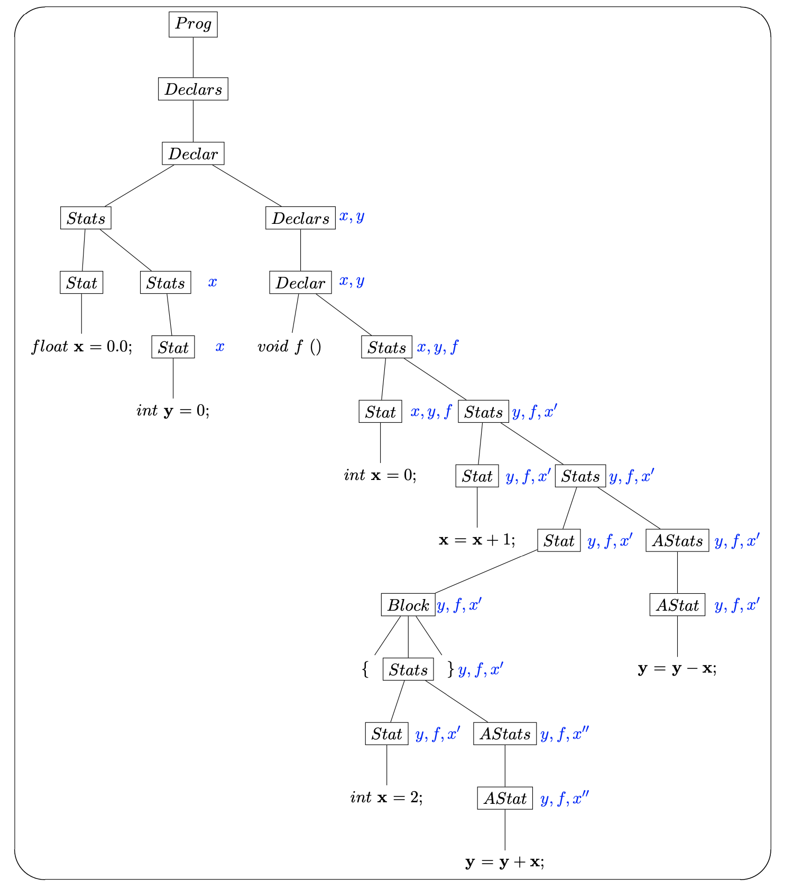

# Binding, Scoping and Control Flow

## (Name) Binding

- Def. An association of entities with identifiers (name)
	- Entities: classes, functions, data, types, etc.
```c++
int i = 1; // Name value
void my_func () {} // Name function
typedef int myint; // Name type
```
- Binding time: the time ([program lifecycle phase](https://en.wikipedia.org/wiki/Program_lifecycle_phase)) to make this association

### Early Binding (Static)
- Def. name binding performed before the program is running (at compile time).
- What are the benefits of static binding?
	- Efficiency: the association are made during the compilation time, which means the compiler could make some optimizations for the code generation
	- Invariance: the compilation phase fixes all types of variables and expressions.

### Late Binding (Dynamic)
- Def. name binding achieved during the program execution (during run time). 
- What are some advantages of this one?
	- Flexibility: languages give more control to programmer (e.g. postpone binding)
	- Polymorphic code: code that can be used on objects of different types is polymorphic.
		- Subtype polymorphism (**dynamic dispatch**)
		- Parametric polymorphism (**generics**)
- Consider the following Python3 code:
```Python
func_lsts = []
for i in range(3):
    def adder(x):
        return i + x
    func_lsts.append(adder)

print('{}'.format(str([adr(2) for adr in func_lsts]))) # [4, 4, 4] 
```
**Q:** What does this program output?
- Here, we define a function `adder` that is a nested function. When you call this nested function, the current environement might differ than defined. So you need a data structure to store those variable binding or value. The closure is a technique to handle this situation.
- Typically, closure is a function object that remember values in enclosing.
- Python's closures are late binding. This means that the values of variables used in closures are bounded at the time the inner function is called.
	- Before `adr(2)` is called, `i` is not bounded to the function `adder`. So, you can imagine each function object contains a function like `def adder(x): return i + x` but not the `def adder(x): return 0/1/2 + x`.
	- Once `adr(2)` has benn called, the last assignement for `i` is used, which is `2`.
- Try to add the following code after the `print` to check it:
```python
print(i) # 2
i = 4
g = func_lsts[0]
print(g(2)) # 4 + 2 = 6
```
- More generally, closure is created inside a function for the inner function, for instance:
```python
def create_adders():
    return [lambda x : i + x for i in range(3)]

print('{}'.format(str([adr(2) for adr in create_adders()]))) # [4, 4, 4] 
```

## Scoping
- Def. A scope is the region of program text where a binding is active.
- Global scope: binding is visible throughout the entire programs.
	- Global variable: a variable with global scope. The lifetime of this kind variable is the duration from the program started to terminated.
- Function scope: the scope of variable is within the function
	- Local variable: a variable with function scope. The lifetime is the duration of the function call.
- Variable shadowing: in a certain scope, if you redeclare a variable, the original binding is hidden, and has a hole in its scope.
- Consider the following C++ example:
```c++
using namespace std; // imports all bindings made in std namespace
int x = 0; // Assume it is a global variable

void f () {
	int x = 4; // x now binds to value 4
	cout<<"The x inside f is: "<<x<<endl;
}

f();
cout<<"The x outside f is: "<<x<<endl;
```
- To be clarified, the `x` we defined outside the `f` has file scope (informally we usually call "global" scope). Here is more [general way](https://en.wikipedia.org/wiki/Global_variable#C_and_C++) to define one real global vairable in C/C++.

### Static / Lexical Scoping
- Def. binding of a name is determined by rules that refer only to the program text.
- Thus, the scope of a variable depends on the code (syntactic) structure.

**Q:** How do we know a variable's scoping by using static scoping approach?

```c++
float x = 0.0;
int y = 0;

void f () {
    int x = 0;
    x = x + 1;
    {
        int x = 2;
        y = y + x;
    }
    y = y - x;
}
```
- Typically, compiled programming languages (e.g. C++, Java) use (parse) tree structure to detect scoping error during the compile time, and interpreted languages (e.g. Python) use stack (via static link) to check variable's scoping in the run time.
- Here is the real (simplified) parse tree for the program:
<p align="center">

</p>

### Dynamic Scoping
- Def. binding of a name is given by the most recent declaration encountered during the run-time.
- That means: the variable's scope is depending on the execution order.

**Q:** How to determine scoping of each variable under dynamic scoping?

```lisp
(defun f ()
    (print x)
)

(defun g()
    (defvar x 2)
    (f)
)

(g)
```

- There are two ways to implement dynamic scoping:
	- Deep access (via dynamic link): during the run time, the compiler traverses the dynamic chain of stacks to look up the variables.
	- Shallow access: use one stack for each variable name.
- But using dynamic scoping is not a better idea than using static for developing.

### Scoping examples
To help you understand the difference, consider this C++ code:
```c++
int x = 2; // This is not a global variabe

void f(){
    int x = 3;
}

int g(){
    f();
    return x + 4;
}

int h(){
    int x = 5;
    return g();
}

printf("function g returns %d", g());
printf("function h returns %d", h());
```
1. Assume program will run under static scoping, what does this program print?
	<details><summary>Solution</summary>
	<p>

	```
	function g returns 6
	function h returns 6
	```
     </p></details>

2. Assume program will run under dynamic scoping, what does this program print?
	<details><summary>Solution</summary>
	<p>

	```
	function g returns 6
	function h returns 9
	```
     </p></details>
     
## Control Flow
- Def. the order of execution for individual statements, expressions, or function calls.

### Sequencing
- Def. execute statements or evaluate expression in sequential order.
- Statement vs. expression:
	- Expression is a combination of one or more explicit identifiers, literals and operators.
		```c++
		1 + 2 // Arithmetic expression
		func_call(3) // Callsite expression
		```
	- Statement is the smallest element that expresses some action to be carried out.
		```c++
		int x; // Declaration Statement
		x = 1; // Assignment Statement
		if (true) {x;} else {0;} // If statement
		for (int i = 0;i<10;i++){x++;} // For loop statement
		return x; // Return statement
		{ x = 3; x = x + 1;} // Block Statement
		```
	- We could say an expression is part of a statement.
- Order of value computation vs. Order of evaluation
	- We have learned the precedence and associativity last week, those guide the compiler to do each computation.
	- Do not confuse order of value computation with order of evaluation.
	- Back to `5 + 2 * 3` example:
		```
			  E
		       /  |   \         
		      E   +    T
		      |      / | \
		      T     T  *  F
		      |     |     |
		      F     F     3
		      |     |
		      5     2
		```
		- It is true that we should follow the precedence and associativity rule to get the correct result `5 + (2 * 3) = 11`. However, the compiler could evaluate `5`, `2` or `3` in any order, it won't affect the final computation.
		- Typically, the order of evaluation follows the preorder traversal.

### Selection
- Def. execute one of two statements according to the value of a Boolean expression.
- Short circuit evaluation: given a Boolean expression, the second argument will not be evaluated if the first condition meets.
- Consider the following C++ code:
```c++
void f () {
    bool x = true;
    bool y = false;
    if (x || (1/0)) {
        cout<<"Pass here!"<<endl;
        return;
    }
}

f();
```

### Iteration
- Def. execute a piece of statements repeatedly.
	```c++
	while (condition) statement
	```
	- `condition` is evaluated at each iteration
	- if it evaluates to `true`, we execute `statement`
	- otherwise, if `false`, we exit the loop.
- Breaking: `break` allows you to jump out of the loop early.
```c++
void f () {
    int i = 0;
    while (i < 10) {
        if (i == 5) break;
        i ++;
    }
    printf("i: %d", i); // i: 5
}
```
