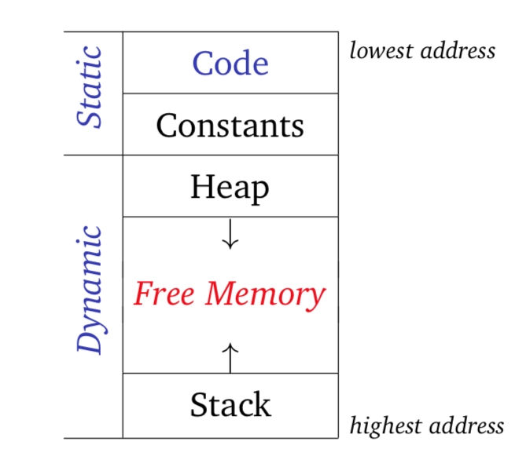
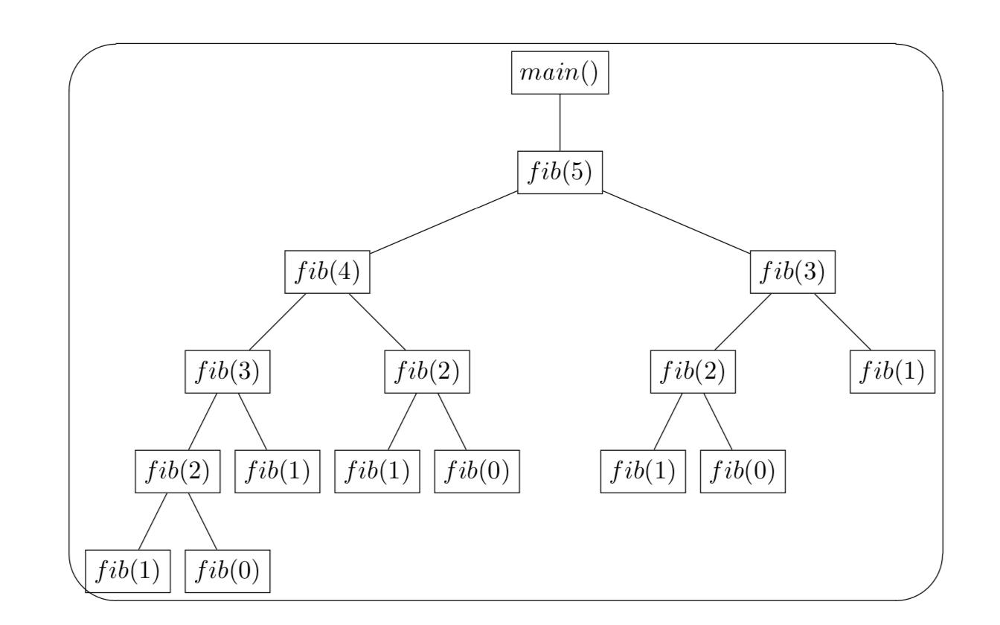

# Stack, Activation Records and Parameter Passing

## Stack
- Def. A stack is a linear structure where data are inserted and deleted according to the last-in first-out (LIFO) principle.
- Operations:
	- Push: adds the element into the container.
	- Pop: removes the most recently added element that was not yet removed.
- Stack-based memory allocation: using stack structure to maintain regions of memory.
- Stack and heap structure in the memeory:
<p align="center">

</p>

## Activation Records / Stack Frames
- Def. the piece of memory on the stack used for storing information of a particular function call.
- Layouts (in general):
	```
	|                          |
	├──────────────────────────┤<- stack pointer
	| Local Data               |
	├──────────────────────────┤
	| Saved registers (Callee) |
	├──────────────────────────┤
	| Saved fp (static link)   |
	├──────────────────────────┤
	| Saved fp (dynamic link)  |
	|==========================|<- frame pointer
	| Return address           |
	├──────────────────────────┤
	| Actual Parameters        |
	├──────────────────────────┤
	| Saved registers (Caller) |
	├──────────────────────────┤
	| Caller activation record |
	|==========================|
	| ...                      |
	```
	- If we use a different calling convention, the layout of a frame might differ. 
- Stack Pointer (SP): points to the top of the stack. That is, it holds the address of the last item put on the stack.
- Components
	- Return Address: store the return address that resumes at the point in the code after the call.
	- Frame Pointer (FP): a pointer that points into the activation record of a subroutine so that any objects allocated on the stack can be referred with a static offset from the frame pointer.
	- Local Data: a space to allow the subroutine to store local vairables.
	- Static Link: a pointer that points to the activation record of the lexically surrounding subroutine. The value that is stored here is the address of the frame of the procedure that statically encloses the current procedure.
	- Dynamic Link: a pointer that points to the frame of the caller. The value that is stored here is the address of its caller’s frame on the stack.
		- What is the difference? Consider the following Python example:
		```python
		def main ():
		    x = 10
		    def f():
		        print(x)
		        g(3)
		
		    def g(y):
		        if y == 1:
		            f()
		        else:
		            print("exit!")
		    g(1)
		
		main()
		```

## Calling & Return Sequence
- Def. it is the conventional sequence of instructions to set up and call a given subroutine and to return after the subroutine is executed.
- Prologue (work before the call): management code executed at the beginning of a subroutine call.
	- E.g. Pass parameters, save return address, update static chain, change PC counter, move SP, save register values, move FP, initialize objects...
- Epilogue (work once the call is completed): management code executed at the end of a subroutine call.
	- E.g. Finalize objects, pass return value back to caller, restore...

## Calling Convention
- Def. a strategy describing how subroutines receive parameters from their caller and how they return a result. 
- Caller: function or procedure who makes the function call.
- Callee: function or procedure has been called.
- The variation depends on compiler, cpu and operation system. There is no general rule.

## Activation trees and execution procedure (Optional)
- Consider this code example:
```c++
int fib (int n) { 
     int t, s;
     if (-1 < n && n < 2) return n; 
     s = fib(n−1);
     t = fib(n−2);
     return s+t;
}
```
**Q:** If we plan to call this function as `fib(5)`, what is the real sequence of steps on the stack during the execution?
	- Using the activation trees to represent the steps.

### Activation trees
- Def. A tree structure to represent the sequence of steps. Execution corresponds to depth-first traversal of the activation tree.
- This tree is used for control flows. It represents a series of activations (function execution order).
- Consider the previous function call, it will have this activation tree:
<p align="center">

</p>

- **Q:** Do you find any redundant execution?

## Parameter passing modes

### Types of parameters
- Formal parameter (parameter): names / variables that appear in the declaration of the subroutine.
- Actual parameter (argument): the expressions passed to a subroutine at a particular call site.

```C++
void func (int x, int y) { // x and y are formal parameters
...
}
int a = 0, b = 0; 
func(a, b); // a and b are actual parameters
func(a+b, atoi("10")); // a+b and atoi("10") are acutual parameters
```
- Assignment and Parameter
	- Mutable parameter: a formal parameter could do assignment.
	- Immutable parameter: a formal parameter only allows to refer the value.
	- In general, we could not do an assignment to a parameter who is immutable.
	```scala
	def f(x: Int):Int = {
		x = x + 1 // reassignment to val
		return x
	}
	
	var z = 1
	incr(z)
	```
	- In Scala, every parameter is immutable (val object).
	- In Ada, we have `in`, `out` and `in out` parameter.

### Evaluation strategy

#### Strict Evaluation
- Def. the actual parameter (actual) is evaluated before the function is evaluated.
- Call by value
  - Formal parameter (formal) is bound to copy of value of actual
  - If you do an assignment to formal, it only changes the value of formal, but not the actual.
  - Language specified by default: C/C++, Java.
- Call by reference
  - Formal is bound to location of actual, forming an alias
  - If you do an assignment to formal, it changes the value of actual.
  - Language supported: C++, C#.

#### Lazy Evaluation
- Def. the actual is evaluated only if it needs to be evaluated.
- Call by name
  - Formal is bound to the *expression* of actual
  - Expression is evaluated **each time** when the formal is used during execution
  - In general, you cannot assign a value to formal. Formal parameter using call-by-name is immutable.  
  - Language supported: Algol 60, Scala.
- Call by need
  - Formal is bound to the *expression* of actual
  - Expression is evaluated **only once** when the formal is used at the first time.
  - **Subsequent reads** from the formal will use the value computed earlier.
  - In general, you cannot assign a value to formal. Formal parameter using call-by-need is immutable. 
  - Language supported: Haskell, R.
  
####  How to calculate the values of several variables in the parameter passing modes? 

1. Call by value --- values are copied by actual parameters when they pass. For instance, in c:
	```c
	int sum (int a, int b) {
		int c = a + b;
		return c;
	}
	
	printf("result: %d\n", sum(1, 2));
	```

2. Call by reference --- formal parameter is the actual one. If you do assignement to the formal, it also affect the value of actual. For example, in C++:
	```c++
	void my_swap (int& x, int& y) {
	    int temp;
	    temp = x;
	    x = y;
	    y = temp;
	}
	
	int a = 3, b = 4;
	my_swap(a, b);
	cout<<"a: "<<a<<"; b: "<<b<<endl; // a: 4, b: 3
	```

3. Call by name --- formal parameter is bound by the expression (execute formal by executing the expression). The expression is evaluated until the parameter will be used. That is, whenever the parameter is used, the expression will be evaluated. Take a Scala code as an example:
	```scala
	def f(x: Int, h: => Unit): Unit = {
	  for(a <- 1 to x){
	    h;
	  }
	}
	
	f(3, println("Eval!"))
	```

4. Call by need --- At first, formal parameter is bound by the expression (execute formal by executing the expression). The expression is evaluated when the formal will be used firstly. After that used, the parameter is bound by the evaluated result. In other words, the expression is evaluated only once, and the remianed uses of that parameter will be treated as a value.

#### Differences Between Strategy
Consider this following Pseudo code:
```scala
Int incr(Int& k) { // call by reference
	k = k + 1
	return k
}

Void f(Int x, Int y) {
  x = y + 1
  println(x + y)
}

Int z = 1
f(z, incr(z))
println(z)
```
**Q:** What does this program print if we make the following assumptions about the parameter passing modes for the parameters `x` and `y` of the function `f`:

1. `x` and `y` using call-by-value parameter
	<details><summary>Solution</summary>
	<p>

	```
	5
	2
	```
     </p></details>

2. `x` is call-by-reference and `y` is call-by-value
	<details><summary>Solution</summary>
	<p>

	```
	5
	3
	```
     </p></details>

3. `x` is call-by-value and `y` is call-by-name
	<details><summary>Solution</summary>
	<p>

	```
	6
	3
	```
     </p></details>

4. `x` is call-by-reference and `y` is call-by-name
	<details><summary>Solution</summary>
	<p>

	```
	7
	4
	```
     </p></details>

### First-class functions and Parameter Passing for functions (Optional)
- In some programming languages (usually functional languages), they treat functions as [first-class citizen](https://en.wikipedia.org/wiki/First-class_citizen).
- Thus, those languages support a subroutine to pass a function as a parameter or to return a function.
- However, function allows to access some local variables defined in an enclosing scope.
- The question is if we pass a function or return a function, how could we remian the environment of that function declared.
	```python
	def create_adder():
		i = 3 # Local variable
		return lambda x : i + x

	adder = create_adder()
	# print(i) error!
	print(adder(2)) # 5 
	```
- Closure: a record storing function (reference) together with an environment.
- Environment: a mapping associating each free variable of the function with the value or reference to which the name was bound when the closure was created.
- Free variable: variable is not defined by the current function.
- Two ways to do the environment binding.

#### Evaluation strategy

1. Deep binding: When an function is passed as an argument / returned by the outer function, it will create a closure that storing function's information and environment. When it is called, the referencing environment is restored.

2. Shallow binding: When the function is called, it uses the current referencing environment at the call site. This relies on the current binding of the variable can always be found.

#### Example
- Consider the following Python code example:
```python
def closure_test(i, a):
    def nested():
        print(i)
    if i > 1:
        a()
    else:
        closure_test(i+1, nested)
    

def void():
    print("this should not be called!")

closure_test(1, void)
```
**Q:** What does this program print if we make the following assumptions about the parameter passing:

1. This code is running under static scoping and deep binding.
	<details><summary>Solution</summary>
	<p>

	```
	1
	```
     </p></details>
2. This code is running under dynamic scoping and shallow binding.
	<details><summary>Solution</summary>
	<p>

	```
	2
	```
     </p></details>
- Consider another Python example:
```python
def f(x, h):
  def g(y):
    return h(x) + y
  if (x == 0):
    return f(2, g)
  else: return g

x = 3

def z(b):
  return  b + x

print(f(0, z)(4))
```
**Q:** What does this function print? (Note that, python uses static scoping and deep binding)
<details><summary>Solution</summary>
  <p>
	  
  ```
  9
  ```
  </p></details>
