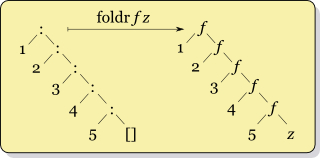

# Racket Programming

## Syntax
For scheme, an expression is either an atom or a list. All expressions use prefix notation.
1. Atom: constants (numbers and Booleans), symbols (variables and inbuilt functions), or special forms `define, lambda, if`.
2. List: a sequence of things in parentheses `(t1 t2 ... tn)`.
3. For instance:
	```scheme
	; single line comment
	#|
	comment multiple lines
	|#
	
	; Constants
	1 ; integer
	#t; boolean
	
	; Symbols
	(define x 1)
	> x
	1
	> (let ((x 1)) x)
	1
	```
4. In expressions, `(e)` means evaluate `e` and then call the resulting function with `0` arguments.
5. Common syntax error when implements a function.
	<p align="center">
	
	</p>
### Semantics
The rules for evaluating Scheme programs:
- A constant evaluates to itself
- A symbol evaluates to its current binding
- A list must be:
    - A form (e.g. `if`, `lambda`), or
    - A function application:
        - the first element of the list must evaluate to a function
        - the remaining elements are the actual parameters

#### List manipulation
The inbuilt list data type provides one constant and three primitive operations:
- Basic forms
	- `'()` or `null`: the empty list
	- `list`: construct a list from given data
	```scheme
	> '()
	()
	> (list 2 #t "mac") ; or '(2 #t "mac")
	(2 #t "mac")
	> (cons 1 (cons 2 (cons 3 (cons 4 (cons 5 '())))))
	(1 2 3 4 5)
	``` 
- Other operations
	- `cons`: prepend an element to a list
	- `car`: get the head of a list
	- `cdr`: get the tail of a list
	- `null?`: check for empty list
	```scheme
	> (car '( this is a list of symbols ))
	this
	> (cdr '( this is a list of symbols ))
	(is a list of symbols)
	> (car '())
	; car: contract violation
	;   expected: pair?
	;   given: '()
	> (null? '())
	#t
	```
- Note that, the above operations come from [dotted pair](https://wiki.call-cc.org/man/4/The%20R5RS%20standard#pairs-and-lists).

#### Lambda expression
Scheme supports implementing anonymous functions that are similar to lambda terms in the lambda calculus.
```scheme
(lambda (x y) (* x y))
```

#### Contol constructs
- Conditional expressions take the form
	```scheme
	(if condition expr1 expr2)
	```
- or more general form:
	```scheme
	(cond
	  [pred1 expr1]
	  [pred2 expr2]
	  ...
	  [#t exprn])
	```
- For instance, if we define a function to sum all the numbers inside a list (could be nested).
- One way to implement this could use if-then-else expression:
	```racket
	(define (sum xs)
	  (if (null? xs)
	      0
	      (if (number? (car xs))
	          (+ (car xs) (sum (cdr xs)))
	          (+ (sum (car xs)) (sum (cdr xs))))))
	```
- Instead of using multiple if-then-else expressions, we can use a better style to write this function:
	```racket
	(define (sum xs)
	  (cond [(null? xs) 0]
	        [(number? (car xs)) (+ (car xs) (sum (cdr xs)))]
	        [#t (+ (sum (car xs)) (sum (cdr xs)))]))
	```

#### Binding constructs
There are three binding constructs:
- `let`: The `let` form evaluates all the `inits` in the current environment; it will introduces the symbols (variables or functions) `x1` to `xn` simultaneously. The scope of these bindings is `body`.
```racket
(let
  ([x1 init1] [x2 init2] ... [xn initn])
  body)
```
Think about `let` as a block like this:
``` scala
{
  val x1, ..., xn = init1, ..., initn
  body
}
```
- `let*`: The `let *` form evaluates each binding from left to right, and each binding is done in an environment in which the previous bindings are visible.
```scheme
(let*
  ((x1 init1) (x2 init2) ... (xn initn))
  body)
```
Think about `let*` as a block like this:
``` scala
{
  val x1 = init1
  ...
  val xn = initn
  body
}
```
- `letrec`: the letrec form can be used to define (mutually) recursive functions. 
	```scheme
	(letrec
	  ((x1 init1) (x2 init2) ... (xn initn))
	  body)
	```
	- The syntax is simmilar with `let` binding, except the allowance of recursive call inside each `init`.

### Exercise
1. Installation: follow [this link](https://racket-lang.org/) to download DrRacket. When you finish installation, open `recitation.rkt` and click the lower left corner to choose languages. Click 'Other languages' and use 'R5RS' as your scheme compiler.
	- The following functions could be referred to the `recitation.rkt`.
2. `rev`: define a function `rev` to reverse a list such as:
```scheme
> (rev '(1 2 3))
(3 2 1)
> (rev '(1 (2 3) 4))
(4 (2 3) 1)
```
- Intuition: you can use an inbuilt function `rev_acc` which takes two lists as inputs: one for extracting element from the origin list `acc` and another for constructing the reversed list `rv`. Then, you extract one item from `acc` and append it into `rv` each time. Finally, allow that function do recursively call until the extracting list `acc` is empty.
- Sample code:
```scheme
; reverse a list
(define (rev ls)
  (letrec
    ((rev_acc (lambda (acc rv)
       (if (null? acc) rv
         (rev_acc (cdr acc) (cons (car acc) rv))))))
         (rev_acc ls '()))
)
```
3. `fold` function (optional): it is [a function](https://en.wikipedia.org/wiki/Fold_(higher-order_function)) to process a collection in a order recursively by applying an external function to each data and to build a return value. Thus, the parameters of `fold` function contains
	- A collection, typically a list or an array.
	- An external function `f` to apply with two parameters:
		- Terminal value `z` - the value for aggregating results to return.
		- Element inside the list
	- Terminal value `z` - a value with the initial format you want to output.
- `foldl`: define a function `foldl` that crosses the list from the begin to the end and recursively fold the list into a single terminal value. So, this function will take a function `f` as parameter, a single value `z` and a list `ls` for traversal. Moreover, for fuction `f`, it will takes two value, the first is an element in the list `ls` and second is the single value `z`.
	- For instance:
	```scheme
	> (foldl + 0 '(1 2 3 4 5)) ; sum of the list
	15
	> (foldl (lambda (x z) (+ 1 z)) 0 '(1 2 3 4)) ; length of the list
	4 
	```
	- Intuition: Your implementation should iterate the list `ls` and recursively call function `foldl` to fold the list into a single value as `f (car ls) z` as `z` for next iteration.
		- This means you 'reduce' each result by applying function `f` with `z` from the head to the tail.
	- Here is an example that how `foldl` works (picture from [WIKI](https://en.wikipedia.org/wiki/Wikipedia:Image_use_policy)):
	<p align="center">
	
	</p>
	
	- Sample code:
	```scheme
	(define (foldl f z ls)
	  (cond
	    ((null? ls) z)
	    (else (foldl f (f (car ls) z) (cdr ls)))
	    )
	)
	```
	- You can also use `foldl` for defining `rev`:
	```scheme
	(define (rev ls) (foldl cons '() ls))
	```

- `foldr`: For `foldr`, it is very similar like `foldl` except you iterate the list from end to the begin. Here is an example that how `foldr` works (picture from [WIKI](https://en.wikipedia.org/wiki/Wikipedia:Image_use_policy)):
<p align="center">

</p>

- This means you 'reduce' the list to get each result by applying function `f` with `z` from the lastest value to the head.
- You can also use `foldr` for defining `map`:
```scheme
(define (map fun lst)
  (foldr (lambda (x y) (cons (fun x) y))
         '() lst
  )
)
```
4. `filter`: a function takes a [predicate](https://en.wikipedia.org/wiki/Predicate_(mathematical_logic)) and an input list, and outputs a list such that an item i in the input list will appear in the output list if pred(i) is true. Concretely, the predicate function takes an item from the list and returns a Boolean value. For instance:
```scheme
> (filter even? '(1 2 3 4))
(2 4)
> (filter integer? '(1 #t 3 (1 2) 3.3 4))
(1 3 4)
> (filter (lambda (y) (> y 2)) '(1 2 3 4))
(3 4)
```
- Intuition: a. iterate the input list; b. for each item in that list, check the item whether it satisfies the predicate or not; c. If that item meets the requirement, put it into the result list.
- You can also use `foldl` and `rev` for defining `filter`:
```scheme
(define (filter pred lst)
  (rev (foldl (lambda (x y) (if (pred x) (cons x y) y)) '() lst))
)
```

#### Unit testing
If you prefer giving the test case during your implementation, here is one package very useful:
```scheme
; Unit tests
(#%require rackunit)
```
Suppose you wanna creat a test for `rev`, we could use function `check-equal?` for assertion:
```scheme
; rev
(check-equal?
 (rev '())
 '())

(check-equal?
 (rev '(1 2 3))
 '(3 2 1))
```
