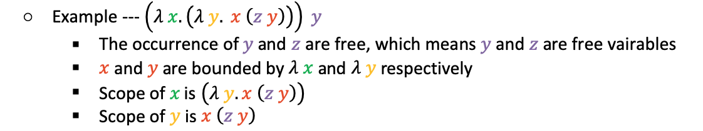
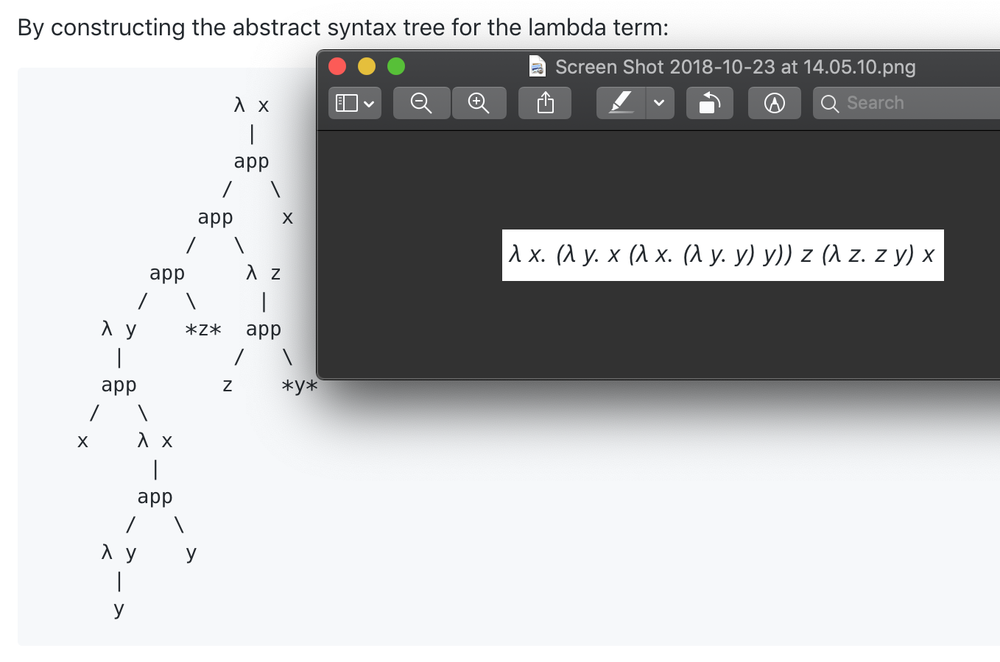
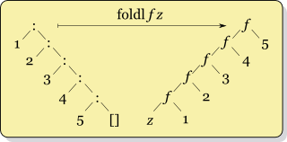
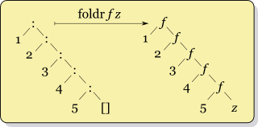

# Tail Recursion, Lambda Calculus & Scheme Programming
## Tail Recursion
- Def. it is a recursion in which no additional computation ever follows a recursive call.
- The recursive function returns what the next recursive call returns. **No more computations** after the recursive call.
```scheme
(define (factorial n) ; standard recursion
        (if (= n 0) 
           1 
          (* n (factorial (- n 1)))
        )
)
(factorial 100000)

(define (fac x) ; tail recursion
  (letrec
    ( ; rec param
     (fac-tr (lambda (x acc)
       (if (zero? x) acc
         (fac-tr (- x 1) (* x acc)))))
    )
    (fac-tr x 1) ; rec body
  )
)
(fac 100000) ; This one is faster than standard recursion
```
- The most benefit for tail recursion is that the compiler can reuse the current activation record at the time of the recursive call, eliminating the need to allocate a new one, i.e. constant stack space.
- The Scheme compiler will detect the tail recursion `fac` and performs [tail-call elimination](https://stackoverflow.com/a/310980) to ensure that `fac` will run in constant stack space. 
- Effectively, tail call elimination yields an implementation that is equivalent to one that uses a loop:
```scheme
(define (fact x)
  (let
    (
     (fact_loop (lambda (x acc)
         (do ((i x (- i 1))          ;   for (i = x; i != 0; i--)
              (acc acc (* acc i)))   ;       acc = acc * i;
              ((zero? i) acc)
          )))
    )
    (fact_loop x 1)
  )
)
```

## [Lambda Calculus](https://en.wikipedia.org/wiki/Lambda_calculus)
- Def. a mathematical logic for expressing computation based on fucntion abstraction and application.
- Thinking lambda calculus as imperative:
```javascript
λ x. t => def ▲ (x) { t } // function def
// ▲ does not mean anything
// In lambda calculus, all functions are anonymous.
(λ x. t) s => 
	def ▲ (x) { t } 
	▲ (s) // function call
```

### Syntax for a term
1. Variable --- `x`
    - A character or string representing a parameter or mathematical/logical value.
2. Abstraction --- `λ x. t`
    - `t` is lambda term (function term) and body for that abstraction.
    - Formal parameter `x` becomes bound in the expression.
3. Application --- `t1 t2`
    - Applying a function with an argument.
    - An application of a function `t1` to an argument `t2`.

### Precedence and associative
- Precedence: application has higher precedence than lambda abstraction.
- Associative: 
	- Applications are left associative
	- Abstractions are right associative
- Shorthand:
	- `λ x y. t` is a shothand for `λ x. (λ y. t)`
	- `t1 t2 t3` is a shothand for `(t1 t2) t3`
	- `λ x y. t1 t2` means `(λ x y. t1 t2)`
- Compound example:
```
λ x y. x y (λ x. y) ⟺ λ x y. ((x y)  (λ x. y))
```

### Binding and Variables
1. Binding and scope
  - Scope: the scope of a parameter is its lambda function term.
  - Binding: In a lambda term, if the name of a variable is occurred in the parameter list, that variable is bounded by the current term.
2. Variable
  - Bound variable: a variable is bounded by a lambda abstraction.
  - Free variable: a variable is not bounded by a lambda abstraction.
3. Example:
<p align="center">

</p>

**Question: How to determine the free variable?**
- Think about this question as how to determine variable scoping (static). 
- We could construct an abstract syntax tree (AST) to determine the variable's scoping, for instance:
```
(λ x. (λ y. x (z y))) y
```
will have this AST:
```
    app
   /   \
  λ x  *y*
   |
  λ y
   |
  app
 /   \
x    app
    /   \
  *z*     y
```
- All the using occurrences of variables in the term are the ones that label the leaves of the tree (`x`, `z`, `y`, `y`)
- To determine binding, for each occurrence, we trace back to its ancestors, the first λ that binds the variable starting from the leaf is the one that the leaf refers to.
- As you can see, when you traverse for each occurrence, two variables are free.

- Abstract syntax tree is very useful when you find a set of free variables inside a complicate lambda expression:
<p align="center">

</p>

#### Exercise
```
λ x . (λ x. (λ y. x) y) z x
```
**Question: What is the set of free variables in this term?**
	<details><summary>Solution</summary>
	<p>
		λ x . (λ x. (λ y. x) **y**) **z** x <br />
		Free variables are **y** and **z**.
         </p></details>

### Alpha renaming (α convension)
- Def. Alpha-renaming is a way to change a bound variable names.
- **Renaming rules**
    - Only bound variables can be renamed, not free variables.
    - Renaming consistency: if we rename `x` in a term `λ x. t`, all occurrences of `x` in `t` must be replaced by `y`. 
        - `λ x. t =a= λ y. t <rename x to y>`
    - Renaming capture-avoiding: if we rename `x` in a term `λ x. t`, for every subterm `t'` inside `t`, if `t'` has a variable `x` that **is bound to** by current `λ x. t`, then `y` must be free in term `t'` by the renaming. Otherwise, you should do renaming for `y` firstly to free `y`.
    	- For instance, `(λ x. (λ y. y x)) <rename x to y> -> (λ y. (λ y. y y))` is not allowed, because `y` does not occur free in `(λ y. y x)`.
		```
		(λ x. (λ y. y x)) <rename x to y>                    =a= 
		(λ x. (λ y. y x) <rename y to z> ) <rename x to y>   =a= 
		(λ x. (λ z. z x)) <rename x to y>                    =a=
		(λ y. (λ z. z y))
		```
- Renaming examples:
	- `λ y. x y <rename y to z> =a= λ z. x z`
	- `λ x . (λ x. (λ y. x) y) z x <rename outer x to w> =a= λ w . (λ x. (λ y. x) y) z w`

### Evaluation via reduction (β reduction)
- Def. A technique to evaluate lambda expression
- Reduction rule: `(λ x. t) s = t[s/x]`
    - `t[s/x]`: for the term `t`, substitute all occurrences of `x` that are bounded by current `λ x. t` to the term `s`.
    - Normal form (reduction's result): an expression cannot be reducted any further.
- Evaluation strategy
    - Normal order: reduce the outermost “redex” first. 
        - `(λ x. (λ y. x y)) ((λ x. x) z) = λ y. ((λ x. x) z) y = λ y. z y`
    - Applicative order: arguments to a function application are evaluated first, from left to right before the function application itself is evaluated.
        - `(λ x. (λ y. x y)) ((λ x. x) z) = (λ x. (λ y. x y)) z = λ y. z y`
    - You can combine these two order strategies during reduction, but the only way to get a terminating reduction is using normal order if the terminating reduction exists.

**Question: How to do the β reduction by giving a lambda expression?**
- My solution is:
	- Before each reduction step, choose one evaluation order or combined
	- Once you selected the application, check if the function needs to do alpha-renaming.
	- Repeat above two steps until no reduction could be made (From outer to inner).

### Renaming & Reduction Examples
1. **Question: How does β reduction relate to α renaming?**
Consider the following examples:
- Example 1:
```
   (λ x. x) x
=> (λ x. x) x         ; x conflicts with abstraction: rename x to z 
=> (λ z. z) x         ; do one step reduction for λ z
=> x
```
- Example 2:
```
   (λ x. (λ x. x) x) (λ x. (λ x. x) x)    #|Evaluate by applicative order|# 
=> (λ x. (λ x. x) x) (λ x. (λ x. x) x)    ; evaluate the argument first, right most x conflicts with λ x: rename x to z
=> (λ x. (λ x. x) x) (λ x. (λ z. z) x)    ; do one step reduction for λ z
=> (λ x. (λ x. x) x) (λ x. x)             ; right λ x conflicts with left λ x: rename left x to y
=> (λ y. (λ x. x) y) (λ x. x)             ; do one step reduction for λ y
=> (λ x. x) (λ x. x)                      ; right λ x conflicts with left λ x: rename left x to w
=> (λ w. w) (λ x. x)                      ; do one step reduction for λ w
=> λ x. x
```
2. Consider the church encodings, we know that:
```
iszero = (λ n. n (λ x. false) true)
0 = (λ s z. z)
1 = (λ s z. s z)
true = (λ x y. x)
false = (λ x y. y)
```
**Question: How do we compute `iszero 1` to get `false` via beta reduction?**
```
    iszero 1                           #|Evaluate by normal order|# 
=> (λ n. n (λ x. false) true) 1        ; by def of iszero
=> 1 (λ x. false) true                 ; do one step reduction for λ n
=> (λ s z. s z) (λ x. false) true      ; by def of 1
=> ((λ s z. s z) (λ x. false)) true    ; application are left associative
=> (λ z. (λ x. false) z) true          ; do one step reduction for λ s
=> (λ x. false) true                   ; do one step reduction for λ z
=> false                               ; do one step reduction for λ x
```

## Scheme Programming
- If you want to learn more about scheme programming, here is [an online wiki](https://wiki.call-cc.org/man/4/The%20R5RS%20standard) you could take a look.
- I suggest you to read: 
	- [Section 2.1](https://wiki.call-cc.org/man/4/The%20R5RS%20standard#primitive-expression-types), section 2.2.1 ~ 2.2.3
	- [Section 3](https://wiki.call-cc.org/man/4/The%20R5RS%20standard#program-structure)
	- Section [4.3.1](https://wiki.call-cc.org/man/4/The%20R5RS%20standard#pairs-and-lists) ~ 4.3.2

### Syntax
For scheme, an expression is either an atom or a list. All expressions use prefix notation.
1. Atom: constants (numbers and Booleans) or symbols (variables and inbuilt functions)
2. List: be nested to form trees.
```scheme
; single line comment
#|
comment multiple lines
|#

; Constants
1 ; integer
#t; boolean

; Symbols
(define x 1)
> x
1
> (let ((x 1)) x)
1
```
### Semantics
The rules for evaluating Scheme programs:
- A constant evaluates to itself
- A symbol evaluates to its current binding
- A list must be:
    - A form (e.g. `if`, `lambda`), or
    - A function application:
        - the first element of the list must evaluate to a function
        - the remaining elements are the actual parameters

#### List manipulation
The inbuilt list data type provides one constant and three primitive operations:
- Basic forms
	- `'()`: the empty list
	- `list`: construct a list from given data
	```scheme
	> '()
	()
	> (list 2 #t "mac") ; or '(2 #t "mac")
	(2 #t "mac")
	> (cons 1 (cons 2 (cons 3 (cons 4 (cons 5 '())))))
	(1 2 3 4 5)
	``` 
- Other operations
	- `cons`: prepend an element to a list
	- `car`: get the head of a list
	- `cdr`: get the tail of a list
	```scheme
	> (car '( this is a list of symbols ))
	this
	> (cdr '( this is a list of symbols ))
	(is a list of symbols)
	> (car '())
	; car: contract violation
	;   expected: pair?
	;   given: '()
	```
- Note that, the above operations come from [dotted pair](https://wiki.call-cc.org/man/4/The%20R5RS%20standard#pairs-and-lists).

#### Lambda expression
Scheme supports implementing anonymous functions that are similar to lambda terms in the lambda calculus.
```scheme
(lambda (x y) (* x y))
```

#### Contol constructs
Conditional expressions take the form
```scheme
(if condition expr1 expr2)
```
or more general form:
```scheme
(cond
  (pred1 expr1)
  (pred2 expr2)
  ...
  (else exprn))
```
#### Binding constructs
There are three binding constructs:
- `let`: The `let` form evaluates all the `inits` in the current environment; it will introduces the symbols (variables or functions) `x1` to `xn` simultaneously. The scope of these bindings is `body`.
```scheme
(let
  ((x1 init1) (x2 init2) ... (xn initn))
  body)
```
Think about `let` as a block like this:
``` scala
{
  val x1, ..., xn = init1, ..., initn
  body
}
```
- `let*`: The `let *` form evaluates each binding from left to right, and each binding is done in an environment in which the previous bindings are visible.
```scheme
(let*
  ((x1 init1) (x2 init2) ... (xn initn))
  body)
```
Think about `let*` as a block like this:
``` scala
{
  val x1 = init1
  ...
  val xn = initn
  body
}
```
- `letrec`: the letrec form can be used to define (mutually) recursive functions. 
```scheme
(letrec
  ((x1 init1) (x2 init2) ... (xn initn))
  body)
```

### Exercise
1. Installation: follow [this link](https://racket-lang.org/) to download DrRacket. When you finish installation, open `recitation.rkt` and click the lower left corner to choose languages. Click 'Other languages' and use 'R5RS' as your scheme compiler.
	- The following functions could be referred to the `recitation.rkt`.
2. `rev`: define a function `rev` to reverse a list such as:
```scheme
> (rev '(1 2 3))
(3 2 1)
> (rev '(1 (2 3) 4))
(4 (2 3) 1)
```
- Intuition: you can use an auxiliary function to take two lists: one for extracting element from the origin list and another for constructing the reversed list.
- Sample code:
```scheme
; reverse a list
(define (rev ls)
  (letrec
    ((rev_acc (lambda (acc rv)
       (if (null? acc) rv
         (rev_acc (cdr acc) (cons (car acc) rv))))))
         (rev_acc ls '()))
)
```
3. `fold` function (optional): it is [a function](https://en.wikipedia.org/wiki/Fold_(higher-order_function)) to process a collection in a order recursively by applying an external function to each data to build a return value. Thus, the parameter contains
	- A collection, typically a list or an array.
	- An external function `f` to apply with two parameters:
		- Terminal value `z` - the value for aggregating results to return.
		- Element inside the list
- `foldl`: define a function `foldl` that crosses the list from the begin to the end and recursively fold the list into a single terminal value. So, this function will take a function `f` as parameter, a single value `z` and a list `ls` for traversal. Moreover, for fuction `f`, it will takes two value, the first is an element in the list `ls` and second is the single value `z`.
	- For instance:
	```scheme
	> (foldl + 0 '(1 2 3 4 5)) ; sum of the list
	15
	> (foldl (lambda (x z) (+ 1 z)) 0 '(1 2 3 4)) ; length of the list
	4 
	```
	- Intuition: Your implementation should iterate the list `ls` and recursively call function `foldl` to fold the list into a single value as `f (car ls) z` as `z` for next iteration.
		- This means you 'reduce' each result by applying function `f` with `z` from the head to the tail.
	- Here is an example that how `foldl` works (picture from [WIKI](https://en.wikipedia.org/wiki/Wikipedia:Image_use_policy)):
	<p align="center">
	
	</p>
	
	- Sample code:
	```scheme
	(define (foldl f z ls)
	  (cond
	    ((null? ls) z)
	    (else (foldl f (f (car ls) z) (cdr ls)))
	    )
	)
	```
	- You can also use `foldl` for defining `rev`:
	```scheme
	(define (rev ls) (foldl cons '() ls))
	```

- `foldr`: For `foldr`, it is very similar like `foldl` except you iterate the list from end to the begin. Here is an example that how `foldr` works (picture from [WIKI](https://en.wikipedia.org/wiki/Wikipedia:Image_use_policy)):
<p align="center">

</p>

- This means you 'reduce' the list to get each result by applying function `f` with `z` from the lastest value to the head.
- You can also use `foldr` for defining `map`:
```scheme
(define (map fun lst)
  (foldr (lambda (x y) (cons (fun x) y))
         '() lst
  )
)
```
4. `filter`: a function takes a [predicate](https://en.wikipedia.org/wiki/Predicate_(mathematical_logic)) and an input list, and outputs a list such that an item i in the input list will appear in the output list if pred(i) is true. Concretely, the predicate function takes an item from the list and returns a Boolean value. For instance:
```scheme
> (filter even? '(1 2 3 4))
(2 4)
> (filter integer? '(1 #t 3 (1 2) 3.3 4))
(1 3 4)
> (filter (lambda (y) (> y 2)) '(1 2 3 4))
(3 4)
```
- Intuition: a. iterate the input list; b. for each item in that list, check the item whether it satisfies the predicate or not; c. If that item meets the requirement, put it into the result list.
- You can also use `foldl` and `rev` for defining `filter`:
```scheme
(define (filter pred lst)
  (rev (foldl (lambda (x y) (if (pred x) (cons x y) y)) '() lst))
)
```

#### Unit testing
If you prefer giving the test case during your implementation, here is one package very useful:
```scheme
; Unit tests
(#%require rackunit)
```
Suppose you wanna creat a test for `rev`, we could use function `check-equal?` for assertion:
```scheme
; rev
(check-equal?
 (rev '())
 '())

(check-equal?
 (rev '(1 2 3))
 '(3 2 1))
```
