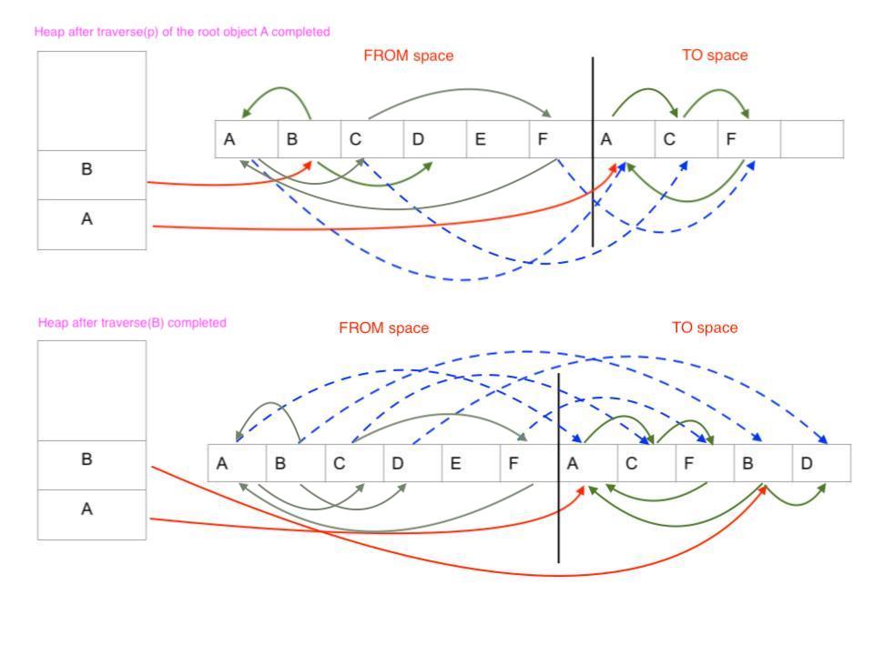

# Midterm Preparation

## Regular Expression
- Syntax
    - Basic:
        - `ε`: represents an empty string, `ε` matches no characters string (empty string).
        - `a`: a single character, `a` matches a string containing only the character a.
    - Concatenation (sequencing): `RS` denotes the set of strings that can be obtained by concatenating a string in `R` and a string in `S`.
        - `RS = { αβ | α ∈ R, β ∈ S }`
    - Alternation: a vertical bar `|` separates alternatives.
        - `a|b` matches `a` or `b`.
    - Repetition:
        - `*`(Kleene star): the set of strings which are concatenations of zero or more occurrences of the preceding element.
            - `a*b` matches `b`, `ab`, `aab` and so on.
        - `+`: the set of strings which are concatenations of one or more occurrences of the preceding element.
            - `a+b` matches `ab`, `aab`, `aaab` and so on.
            - `a+` = `aa*`

### Exercise
1. Write an regular expression that matches the positive float point number with the following restriction:
```
Should Match:
1.2
0.35
0.007
0.0
Should not match:
+1.2
-3.4
01.23
3
0
```

	<details><summary>Solution</summary>
	<p>

	```
	([1-9][0-9]*|0)\.[0-9]+
	```
     </p></details>

## Context Free Grammar
- Terminals: the set of the alphabet of the language
- Nonterminals: the set of variables, each variable represents a different type of phrase or clause in the sentence
- Productions: rules for replacing a single non-terminal with a string of terminals and non-terminals
- Starting symbol: a nonterminal, used to represent the whole sentence (or program)
### Exercise
Provide a context free grammar over the alphabet {`a`,`b`} such as:
1. Accept a string that `a` followed by `b` and the number of `a`'s is more than the number of `b`'s:
```
a
aab
aaab
aaaaabbb
...
```
	<details><summary>Solution</summary>
	<p>

	```
	S -> aA
	A -> aA | B
	B -> aBb | ε
	```
     </p></details>

2. Challenge yourself to consider all strings with more a’s than b’s:
```
a
bbabaaa
ababaab
aba
baaaa
...
```
	<details><summary>Solution</summary>
	<p>

	```
	S -> aA | MS | SMA
	A -> aA | ε
	M -> MM | bMa | aMb | ε
	
	```
     </p></details>

- Here is the [website](https://web.stanford.edu/class/archive/cs/cs103/cs103.1156/tools/cfg/) for testing the correctness of CFG.

## Static vs. Dynamic Scoping
1. Static scoping: binding of a name is determined by rules that refer only to the program text. (i.e. its syntactic structure)
2. Dynamic scoping: binding of a name is given by the most recent declaration encountered during run-time.

### Exercise
Consider this code snippet:
```c
int a = 0, b = 0, c = 0; //
void q(); // Declare function q

void p() {
    int a = 1;
    b = 1;
    c = a + b;
    a = c + b;
    q();
}
void print() { printf("%d %d %d\n", a, b, c); }

void q() {
    int b = 2;
    a = 2;
    c = a + b;
    b = c + a;
    print();
}

int main()
{
    int c = 3; 
    p();
    print();
    return 0;
}
```
1. In c programming, we know that c is using static scoping. What does this program print when it runs?

	<details><summary>Solution</summary>
	<p>

	```
	2 1 4
	2 1 4
	```
     </p></details>

2. Now assume the program is running under dynamic scoping. What does this program print?

	<details><summary>Solution</summary>
	<p>

	```
	2 6 4
	0 1 4
	```
     </p></details>
   
- To consider dynamic scoping, you can use **stack frame** to remeber the declaration order during the running time. For instance, here is a simple stack frame when the program called `print()` inside function `q()`:
	```
	|                          |
	|==========================|
	| print():                 |
	|==========================|                               
	| q():                     |                               global var
	|  int b = 6               |                              |  a = 0  |
	|==========================|                              |  b = 1  |
	| p():                     |                              |  c = 0  |
	|  int a = 2               |
	|==========================|
	| main():                  |
	|  int c = 4               |
	|==========================|
	| ...                      |
	```
- The variable `a`, `b` and `c` inside `print()` should be bounded the most recent declaration, where referred `a` is bounded by variable `a` inside function `p()`, `b` is bounded by variable `b` inside function `q()`, and `c` is bounded by variable `c` inside function `main()`.

## Parameter Passing Modes
1. Strict evaluation: call-by-value, call-by-reference
2. Lazy evaluation: call-by-name, call-by-need

### Exercise
Consider this following code:
```c++
/* static scoping */
int z = 1;

/*Note: evaluations for addition and printf are both left_to_right*/

void f(int x, int y) { // suppose formal could be assigned
    x = y + z;
    printf("%d %d\n", x, y);
}

f(z, {z = z + 1; z}); // {z = z + 1; z} = increments z by 1 and then returns the value z
printf("%d\n", z);
```
What does this program print if we make the following assumptions about the parameter passing modes for the parameters `x` and `y` of `f`:

1. `x` and `y` using call-by-value parameter

	<details><summary>Solution</summary>
	<p>

	```
	4 2
	2
	```
     </p></details>

```c++
int z = 1;

void f(int x, int y) { // x = 1, y = 2, z = 2
    x = y + z;
    printf("%d %d\n", x, y);
}

f(z, {z = z + 1; z}); // {z = z + 1; z} = 2
printf("%d\n", z);
```

2. `x` is call-by-reference and `y` is call-by-value

	<details><summary>Solution</summary>
	<p>

	```
	4 2
	4
	```
     </p></details>

```c++
int z = 1;

void f(int x, int y) { // x = z = 2, y = 2
    x = y + z;
    printf("%d %d\n", x, y);
}

f(z, {z = z + 1; z}); // {z = z + 1; z} = 2
printf("%d\n", z);
```

3. `x` is call-by-value and `y` is call-by-name

	<details><summary>Solution</summary>
	<p>

	```
	4 3
	3
	```
     </p></details>

```c++
int z = 1;

void f(int x, int y) { // x = 1, y = {z = z + 1; z}
    x = y + z; // y = {z = z + 1; z} = 2, z = 2
    printf("%d %d\n", x, y); // y = {z = z + 1; z} = 3
}

f(z, {z = z + 1; z});
printf("%d\n", z);
```

4. `x` is call-by-reference and `y` is call-by-name

	<details><summary>Solution</summary>
	<p>

	```
	4 5
	5
	```
     </p></details>

```c++
int z = 1;

void f(int x, int y) { // x = z, y = {z = z + 1; z}
    x = y + z; // y = {z = z + 1; z} = 2, z = 2 -> x = z = 4
    printf("%d %d\n", x, y); // x = z = 4, y = {z = z + 1; z} = 5
}

f(z, {z = z + 1; z});
printf("%d\n", z); // z = 5
```

## Lambda Calculus

### Exercise
1. Determine the set of free variables inside this lambda expression:
```
(λ x. (λ y. x) y (λ x. x)) (λ z. z) x
```
Moreover, show an alpha-renaming of the term such that no variable is bound more than once.

	<details><summary>Solution</summary>
	<p>

	```
	free variable: y, x
	(((λ x. (((λ y. x) *y*) (λ x. x))) (λ z. z)) *x*)
	Syntax tree to determine those free variables:
	                   app
	                  /   \
	                app   *x*
	               /   \
	             λ x   λ z
	              |     |
	             app    z
	            /   \
	          app   λ x
	         /   \   |
	       λ y   *y* x 
	        |
	        x
	after renaming: (λ x1. (λ y. x1) y (λ x2. x2)) (λ z. z) x
	```
     </p></details>

2. Consider the church encoding, we know that:
```
true = (λ x y. x)
false = (λ x y. y)
0 = (λ s z. z)
1 = (λ s z. s z)
succ = (λ n s z. s (n s z))
pair = (λ x y b. b x y)
fst = (λ p. p true)
snd = (λ p. p false)
pred = λ n. snd (n (λ p. pair (succ (fst p)) (fst p)) (pair 0 0))
```
How do we compute `pred 1` to get `0` via beta reduction?

	<details><summary>Solution</summary>
	<p>
	
	```
	    pred 1
	=> (λ n. snd (n (λ p. pair (succ (fst p)) (fst p)) (pair 0 0))) 1   ; by def of pred
	=> snd (1 (λ p. pair (succ (fst p)) (fst p)) (pair 0 0))            ; do one step for λ n
	=> snd ((λ s z. s z) (λ p. pair (succ (fst p)) (fst p)) (pair 0 0)) ; by def of 1
	=> snd ((λ p. pair (succ (fst p)) (fst p)) (pair 0 0))              ; do two steps for λ s and λ z
	=> snd (pair (succ (fst (pair 0 0))) (fst (pair 0 0)))              ; do one step for λ p
	=> snd (pair (succ (fst (pair 0 0))) (fst ((λ x y b. b x y) 0 0)))  ; by def of pair
	=> snd (pair (succ (fst (pair 0 0))) (fst (λ b. b 0 0)))            ; do two steps for λ x and λ y
	=> snd (pair (succ (fst (pair 0 0))) ((λ p. p true) (λ b. b 0 0)))  ; by def of fst
	=> snd (pair (succ (fst (pair 0 0))) ((λ b. b 0 0) true))           ; do one step for λ p
	=> snd (pair (succ (fst (pair 0 0))) (true 0 0))                    ; do one step for λ b
	=> snd (pair (succ (fst (pair 0 0))) ((λ x y. x) 0 0))              ; by def of true
	=> snd (pair (succ (fst (pair 0 0))) 0)                             ; do two steps for λ x and λ y
	=> (λ p. p false) (pair (succ (fst (pair 0 0))) 0)                  ; by def of snd
	=> (pair (succ (fst (pair 0 0))) 0) false                           ; do one step for λ p
	=> ((λ x y b. b x y) (succ (fst (pair 0 0))) 0) false               ; by def of pair
	=> false (succ (fst (pair 0 0))) 0                                  ; do three steps for λ x, λ y and λ b
	=> (λ x y. y) (succ (fst (pair 0 0))) 0                             ; by def of false
	=> 0                                                                ; do two steps for λ x and λ y
	```
     </p></details>

## Scheme Programming

### Exercise
1. `pack`: define a function `pack` that packs consecutive duplicates of list elements into sublists.

For example:
```scheme
> (pack '(a a a a b c c a a d e e e e)) 
((a a a a) (b) (c c) (a a) (d) (e e e e)) 
```
- Intuition: using foldr will help you simplify the conversion. Basically, foldr will iterate the list from end to begin and use the input function `f` with two arguments to reduce the result (an element on the list and single value `z`). Thus, you can create an empty list as `z` for calling `foldr`. During `foldr` iterating list, check element in the list and contruct either current element should build a new sublist or append it into the first sublist inside `z`. 
For example, consider giving `foldr` function a list `'(a a a b b)`:
```
      f =>    '((a a a) (b b))
     / \
    a   f =>  '((a a) (b b))
       / \
      a   f => '((a) (b b))
         / \
        a   f => '((b b))
           / \
          b   f => '((b))
             / \
            b   z = '()
```

	<details><summary>Solution</summary>
	<p>

	```scheme
	; foldr
	(define (foldr f s L)
	(if (null? L) s (f (car L) (foldr f s (cdr L)))))
	
	; pack
	(define (pack ls)
	  (cond
	    ((null? ls) '())
	    (else (foldr (lambda (x z)
	      (cond
	          ((null? z) (cons (cons x '()) z))
	          ((= x (caar z)) (cons (cons x (car z)) (cdr z)))
	          (else (cons (cons x '()) z))
	      )) '() ls)
	    )
	  )
	)
	```
     </p></details>

2. `split`: define a function `split` that splits an input list into two parts by given a length of the first part.

For instance:
```scheme
> (split '(a b c d e f g) 3)
((a b c)(d e f g))
```

	<details><summary>Solution</summary>
	<p>

```scheme
; split
(define (split ls n)
  (letrec ((split-rec (lambda (ls n res)
      (cond
        ((= n 0) (append res (cons ls '())))
        (else (split-rec (cdr ls) (- n 1) (cons (append (car res) (list (car ls))) (cdr res)))))
  )))
  (split-rec ls n '(())))
)
```
     </p></details>

# Memory Management and Garbage Collection

## Memory management
In a program, the memory used to store the data and code at run-time typically is split into three pieces:
- Data segment: stores objects whose life cycle lives the entire program execution
    - E.g. Global variables, code of program etc.
- Heap: store the values of objects whose life cycle is dynamic
    - The lifetime of objects 
    - Managed by the programmer
        - Use after free occurs --- access a dangling pointer
        - Double free errors --- deallocating objects multiple times
        - Memory leaks --- not deallocating after no longer used
    - Automatically by the language
        - Garbage collection
        - Reference mounting
        - Ownership types
- Stack: store the values of local variables in function activation records
    - Using stack is preferred because low overhead, allocated data is freed when data is no needed
    - Objects that are allocated on the stack cannot change their size dynamically

## Garbage collection
- Def. an automatic memory management. A garbage collector attempts to reclaim the memory occupied by objects that are no longer in use by the program.

### Copying
- Intuition
    - Two parts: FROM space, TO space
    - Objects allocated in FROM space
    - When FROM space is full, run GC()
    - During traversal, each encountered object is copied TO space
    - When is done, all live objects are in TO space
    - Swap FROM space and TO space
    - By leaving a forward address, any pointers to the moved objects will be updated.
- Algorithm
```c++
GC()
  for each root pointer p do
    p := traverse(p);
    
traverse(p)
  if *p contains forwarding address then
    p := *p;  // follow forwarding address
    return p;
  else 
    new_p := copy (p, TO_SPACE);
    *p := new_p; // write forwarding address
    for each pointer field p->x do
      new_p->x := traverse(p->x);
    return new_p;
```
**Question:** How does the `traverse` work? Consider the following example:
<p align="center">

</p>

Suppose the root pointer now points to object `A`. Draw the FROM and TO space after the call of `GC()`. 


#### Exercise
Consider this FROM heap, assume the root pointer points to objects `A`, `B`. Draw the FROM and TO space after the call to `traverse` for each of root pointer. To be clear, you should draw 2 heaps (each with FROM and TO space) with forwarding address pointers.
<p align="center">

</p>

	<details><summary>Solution</summary>
	<p>
		<p align="center">
		
		    </p>
     </p></details>
     
