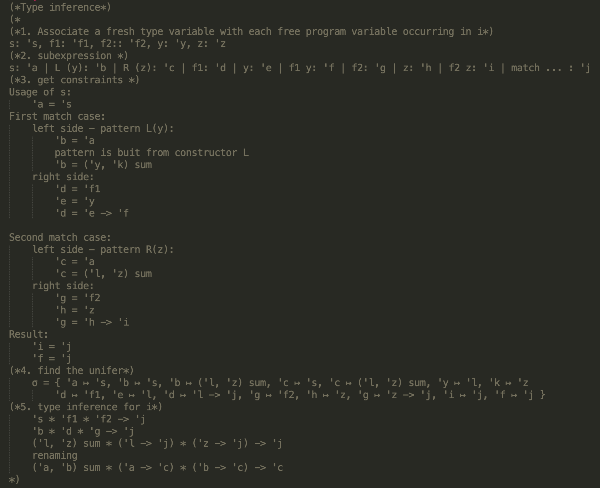

# Standard ML
## Recap
- If you haven't installed SML, please follow the [instructions](https://www.smlnj.org/dist/working/110.96/index.html) to download SML.
- If you prefer online tools, here is a [tool](https://www.tutorialspoint.com/execute_smlnj_online.php) to help you play SML easily.
- Before this class, you have to review some basic components for SML. Please check [Week 06](https://github.com/LinerSu/nyu-pl-spring-20-rec/tree/master/Week%2006) for more details.

## Function types
- Remeber that, function types are constructed using an arrow type constructor `->`. 
- For instance, the type `t1 -> t2` represents functions that take a value of type `t1` and return a value of type `t2`.
- Now we take a complicate function as an example:
	```sml
	fun example (i: int) (f: bool -> int) (lst: int list) : int list = 
		...
	```
	- The question is how could we represent the type for function `example`?
- [Type signature](https://en.wikipedia.org/wiki/Type_signature): defines the inputs and outputs for each function.
- [Currying](https://en.wikipedia.org/wiki/Currying): a process that translates a function taking multiple arguments into a sequence of functions, each of them with a single argument.
	- Remember that, the lambda abstraction are right associative. Is this a coincidence?
- For example, if a function is defined and took this signature `int -> (bool -> int) -> int list -> int list`:
	- In lower level representation, the SML interprets this function like an "onion":
		- Take an `int` argument and return a function with signature `(bool -> int) -> int list -> int list`
		- The returned function takes a `bool -> int` function argument and returns another function with signature `int list -> int list` 
		- The new returned function takes an `int list` and returns an `int list`.
	- However, I would rather use a "common" way to look at function type in functional languages.
	- I say this function takes three arguments and returns a output.
- [Partial application](https://en.wikipedia.org/wiki/Partial_application): a technique of fixing a number of arguments to a function, producing another function of smaller arguments.
- For instance
	```sml
	fun adder a b = a + b
	fun add3 x = adder x 3 (*Closure required at the run time*)
	```
- Note that, in ML family, functions are defined in curried form by default.

## Pattern matching
- Def. the act of checking a given sequence of variables for the presence of the constituents over some patterns.
    - Any variable contains some patterns. However, the patterns for some variables may effect the code implementation.
    	- For instance, by given a list, it has two patterns: empty or nonempty. The implementation for a function might need different actions based on those two patterns.
    - To make it simpler, think about this like "We consider to do several actions based on different patterns of some vairables, but this time we don't need to write `if-then-else`."

### Patterns in SML
- Constant `c` --- `1`, `"this"`, `()`, `{}`...
- Wildcard `_` --- match any value and ignore its pattern
- Variable pattern `x` --- match any value that will bind to variable `x`
- Tuple pattern: `(p1, p2, ..., pn)` – match a tuple that contains elements matched by the patterns `p1` to `pn`
- List patterns:
    - `[]` --- an empty list
    - `hd::tl` --- a list with a head element bound by variable `hd` and the remain list bound by vairable `tl`
- Variable binding pattern `x as p` --- match a pattern `p` that binds as a variable `x`
- Or any other datatypes predefined (Check datatype for more details).
    
### Format
- Standard format: 
	```sml
	case <exp> of
	<pattern1> => <exp1>
	| <pattern2> => <exp2>
	| · · · · · · · · ·
	| <patterni> => <expi>
	```
	- For example, define a function that calculates the length of a list:
	```sml
	fun len lst = 
	    case lst of
	     [] => 0
	    |(hd::tl) => 1 + (len tl)
	```
	- If you want to match multiple variables at a same time, you can make `<exp>` as a tuple --- `<arg1>, <arg2>, ..., <argn>`
	- For any variables you matching, I suggest you fully cover the patterns inside pattern matching, even though you know some patterns won't be matched at the run time.
- Special case for matching the parameters of a function: 
	```sml
	fun name <pattern1> = · · ·
	  | name <pattern2> = · · ·
	  | · · ·
	```
	- In this format of pattern matching, you can match multiple arguments inside patterns by considering different combined cases. For instance, we can implement a `&&` operator:
	```sml
	fun && false _ = false
	  | && true false = false
	  | && true true = true
	```

## Types in Standard ML
### Type Inference
- Please find my slides [here](https://github.com/LinerSu/nyu-pl-spring-20-rec/blob/master/Week%2010/Type%20inference.pdf).
- [Optional] Here is a [tutorial](https://github.com/nyu-pl-fa18/class09#hindley-milner-type-system) to discuss more details of type inference algorithm.
- For examples, suppose we want to write SML functions that satisfy the following polymorphic type signatures:
	```sml
	(** f: ('a -> 'b) -> ('b -> 'c) -> 'a -> 'c *)
	fun f ... = ???
	
	(** g: ('a * 'b -> 'c) -> 'a -> 'b -> 'c *)
	fun g ... = ???
	```

### Algebraic datatypes (ADTs)
- Def. a kind of compisite type, where a type formed by combining other types.
    - `datatype` could be constructed by other types.
    - `datatype` could be defined recursively.
    - The "algebra" here is mixed by a "sum" (alternation) of the type’s members and a "product" (combination) of subtypes. 
- Forms (EBNF):
	```sml
	<datatype>        ::= 'datatype' [<parameter_list>] <name> '=' <subtype> 
				['|' <subtype>]*
	<parameter_list>  ::= <type variable> | '('<type variables>')'
	<subtype>         ::= <user defined data constructor> | <name tag> of <product types>
	<product types>   ::= <type> ['*' <type>]*
	<type variables>  ::= <type variable> `,` <type variables>
	```
	- `<subtype>` represent a type’s member in datatype.
	- `<parameter_list>` in here allows you to use any fresh type variables as type parameters.
	- `<type>` in here could be any types (basic types or type generated by [type constructor](https://en.wikipedia.org/wiki/Type_constructor)).
	- The `<name tag>` is not only used to combine the contained values into a single structure that can be assigned to a variable, but also used for distinguishing the different alternatives.
- Structural equivalence vs Name equivalence
	- Structural equivalence: two types are equal iff they have the same structure.
		- For instance, define `type` in SML:
			```sml
			type day = int * string
			type month = int * string

			val a: day = (3, "day")
			val b: month = (5, "month")
			val c: day = b
			``` 
	- Name equivalence: two types are equal iff they have the same name.
		- For example, define `datatype` in SML:
		```sml
		datatype day = Date of int * string
		val a: day = Date(3, "day")

		datatype month = Date of int * string
		val b: month = Date(5, "month")

		val c: day = a (*Type of a and c are name equivalence*)
		val d: month = c (* Error! datatype are not structural equivalence*)
		```
- Now back to `datatype`. For example, you can define a datatype for a binary tree like this:
	```sml
	datatype btree =
	    Leaf
	  | Node of int * tree * tree
	```
	- For datatype `btree`,  we say any value has a `btree` type could either be a `Leaf` value or a `Node` value. Concretely, for the `Node` value, it should be a combination (tuple in SML) of an integer with two subtrees.
- You can also define a polymorphic datatype. For instance, we could define a binary tree where the type of the value inside each node is undetermined:
	```sml
	(* Polymorphic ADTs *)
	datatype 'a bstree = (* single type parameter *)
	      Empty 
	    | Node of 'a * 'a bstree * 'a bstree
	```
	- Once you have this datatype, you can make a binary search tree (BST) as:
		```sml
		val t1 = Node(3,Node(1,Empty,Node(2,Empty,Empty)),Node(4,Empty,Empty)) (*int bstree*)
		val t2 = Node("Btree", Empty, Empty) (*string bstree*)
		```
	- However, you can't make a binary tree by combining  different subtypes:
		```sml
		(*
		val t3 = Node("Btree", Empty, Node(1,Empty,Empty)) ; overload conflict
		*)
		```
		- Why? [Restriction](https://github.com/LinerSu/nyu-pl-spring-20-rec/tree/master/Week%2006#limitations-of-type-system)?
- You may add more type parameters by grouping them as a tuple:
```sml
datatype ('a, 'b) bktree = (* multiple type parameters *)
      Empty 
    | Node of 'a * 'b * ('a, 'b) bktree * ('a, 'b) bktree
```

### Optional type
- One of the predefined ADTs in SML is the `option` type:
	```sml
	datatype 'a option = NONE | SOME of 'a
	```
- This type is very useful when you try to search or find a value but may not always have a defined return value. You could return NONE as result instead of raising a NOT FOUND error. For instance, here is how we can implement a function to find the value in an `int` type binary search tree, if such a value exists:
	```sml
	datatype 'a bstree =
	      Empty 
	    | Node of 'a * 'a bstree * 'a bstree

	fun find t k = case t of
	    Empty => NONE
	  | Node (v, left, right) =>
	    if v = k then SOME v
	    else if v > k then find left k
	    else find right k
	```

### Exercise
- **[Easy]** How to define a List by using ADTs? Try to give a pretty-much equivalent definition on SML.
	- Let's say a list could be either empty (Nil) or constructed (Cons) recursively via an element and a tail lists. The datatype should allow type polymorphism, whereas the elements inside a list must remain the same type. For instance, your solution should match the following function:
	```sml
	fun len Nil = 0
	  | len (Cons (hd,tl)) = 1 + len tl
	```

	<details><summary>Solution</summary>
	<p>

	```sml
	datatype 'a mylist = 
	    Nil
	  | Cons of 'a * 'a mylist
	```
     </p></details>
- **[Medium]** Write a function that `insert` a new tree Node to an `int` type binary search tree:
	```sml
	(* type for binary search tree *)
	datatype 'a bstree =
	      Empty 
	    | Node of 'a * 'a bstree * 'a bstree
	
	(* 
	function signature should be:
	val insert = fn : int btree -> int -> int bstree
	 *)
	fun insert ... = ???
	
	(* for example *)
	- val t1 = Node(1, Empty, Empty);
	- insert t1 3;
	val it = Node (1,Empty,Node (3,Empty,Empty)) : int bstree
	- insert t1 0;
	val it = Node (1,Node (0,Empty,Empty),Empty) : int bstree
	- insert t1 1;
	val it = Node (1,Empty,Empty) : int bstree
	```

	<details><summary>Solution</summary>
	<p>

	```sml
	fun insert t i =
	   case t of
	     Empty => Node (i,Empty,Empty)
	   | Node (i',l,r) =>
	        if (i = i') then Node (i',l,r)
	        else if (i < i') then Node (i',insert l i,r)
	        else Node (i',l,insert r i)
	```
     </p></details>
- **[Medium]** Determine if the following function definitions are type correct. If not, explain where and why the function has a type error.
	```sml
	fun bigger a b = if a then b - a else a - b
	
	fun compose f g = fn x => f (g x)
	
	fun reverse l = case l of
	    [] => []
	  | (h::t) => (reverse t) :: h
	  
	fun forall p l =
	  case l of 
	  [ ] => SOME true
	  | (h::t) => (case (forall p t) of
		  SOME b => (p h) orelse b (*orelse is '||'*)
		| NONE => NONE)
	```
	
	<details><summary>Solution</summary>
	
	1. `bigger`: Type error on variable `a`. The condition experssion expect variable `a` has a boolean type. However, `b - a` infers that `a` should be an `int`.
	2. `compose`: No error.
	3. `reverse`: Error on second match case `(reverse t) :: h`. Reason: In the first case, we could infer the reverse function returns a `'a list` as a result. However, in the second case, `reverse t` will construct a list of list as a result, which will cause type result circularity.
	4. `forall`: Error on `(p h) orelse b`. The result type for function `forall` expects `bool option` but that expression has type `bool`.
	 </details>
	 
	- **[Challenge]** Could infer the types for the correct functions?
- **[Hard]** Try to infer the types for the function `i`:
	```sml
	(* Defined datatype *)
	datatype ('a,'b) sum = 
	    L of 'a 
	  | R of 'b;
	
	
	(* Infer the type for function i *)
	fun i (s, f1, f2) = case s of
	  L(y) => f1 y
	| R(z) => f2 z
	```
	<details><summary>Solution</summary>

	1. Based on the header (return type + function name + parameter list), we say this function should return a type of `'b` if function inputs one argument with a type `'a`. Now the function should have a type:
		```ocaml
		'a -> 'b
		```
	2. Let's first look at the parameter, the input is a tuple that contains three elements. We associate them with types of 'c, 'd and 'e. Therefore, we have `'a = 'c * 'd * 'e`. Now the function `i` should have a type:
		```ocaml		
		'c * 'd * 'e -> 'b
		```
	3. Now we check the function body, it contains a pattern matching:
		- Looking at the first matching, the pattern of `s` should indicate that `s` has a type of `sum`. Thus, we annotate two fresh type variables for the parametric types of sum: `'f` for `L` and `'g` for `R`, where `'c = ('f, 'g) sum`. `L(y)` we know `y` should have a type `'f`.
			- The first match returns a function call `f1 y`, which we also know the type of the return value is same as what the function `i` returns. Thus, the type of the return value of the call should be `'b`. We know the type for `f1` should be `'d = 'f -> 'b`. 
			- Right now, the function `i` has a type:
		```ocaml
		('f, 'g) sum * ('f -> 'b) * 'e -> 'b
		```
		- Looking at the second matching, the pattern `R(z)` we know `z` should have a type we inferred from `s`, which is `'g`.
			- The second match returns another function call `f2 z`, which we also know the type of the return value is same as what the function `i` returns. Thus, the type of the return value of that call should be `'b`. We know the type for `f2` should be `'e = 'g -> 'b`. 
			- For now, the function `i` has a type:
		```ocaml
		('f, 'g) sum * ('f -> 'b) * ('g -> 'b) -> 'b
		```
	4. Finally, renaming the type variables for the function `i`. We get:
	```ocaml
	('a, 'b) sum * ('a -> 'c) * ('b -> 'c) -> 'c
	```
	 </details>
- **Optional** Show the concrete process of type inference for the above example.
	<details><summary>Solution</summary>
	<p>
	<p align="center">
	
	</p>
	     </p></details>

### Notes
- If you plan to overview the syntax of SML, please find [this](https://learnxinyminutes.com/docs/standard-ml/) webpage for more details.
- Here is a [tutorial](https://www.classes.cs.uchicago.edu/archive/2007/winter/22610-1/docs/sml-tutorial.pdf) for SML, hope it helps you review the basic syntax.
- You can also find some exercises in file `exer.sml`.
