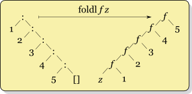
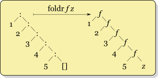

# Standard ML Programming & Exception

## Library Functions
- `fold` function (optional): it is [a high order function](https://en.wikipedia.org/wiki/Fold_(higher-order_function)) that processes a collection in a order recursively by applying an external function to each data and to build a return value. Thus, the parameters of `fold` function contains
	- A collection, typically a list or an array.
	- An external function `f` to apply with two parameters:
		- Terminal value `z` - the value for aggregating results to return.
		- One element `elem` inside the list.
		- **Note that**, in SML, this external function takes one parameter `(elem, z)`.
	- Terminal value `z` - a value with the initial format you want to output.
- `foldl`: define a function `foldl` that crosses the list from the begin to the end and recursively fold the list into a single terminal value.
	- Here is an example that how `foldl` works (picture from [WIKI](https://en.wikipedia.org/wiki/Wikipedia:Image_use_policy)):
	<p align="center">
	
	</p>
- `foldr`: For `foldr`, it is very similar like `foldl` except you iterate the list from end to the begin. Here is an example that how `foldr` works (picture from [WIKI](https://en.wikipedia.org/wiki/Wikipedia:Image_use_policy)):
<p align="center">

</p>
- `filter`: a function takes a [predicate](https://en.wikipedia.org/wiki/Predicate_(mathematical_logic)) and an input list, and outputs a list such that an item `i` in the input list will appear in the output list if `pred(i)` is true. Concretely, the predicate function takes an item from the list and returns a Boolean value.

### Exercise
- Please find `exer.sml` for more details.

## Exception Handling

### Exception & Handling (Software Level)
- Exception: An exception is an event that disrupts the normal operation of the program's execution.
	- It occurs during the execution.
- Exception vs. Error
	- Error
		- An error we usually say (in Java) is a serious problem that we should not handle it. Recovering from an error is not possible and not allowable.
		- For instance, stack overflow in C++:
		```c++
		int main(void)
		{
		    main();
		    return 0;
		}
		```
		- During the run time, the compiler will allocate "infinite times" of frames for `main` function, until the stack to overflow (segmentation fault).
		- The behavior for allocating inifite stack is not promising.
	- Exception
		- It is a case we want to handle it through programming langauges.
		- E.g. Item Not Found, Index Out of Bound, etc.
- Exception handler: it is a process that handles those "exceptional situations." Handler requires a special process to respond those exception during computation.
	- In programming langauges level:
		- The *exception* is used for storing information about an exceptional condition. 
		- The *throw* is used to raise an exception.
		- Once an exception is thrown, the execution now is transferred to a *catch*.
	- Why we need exception handling?
		- Seperation from the normal flow
			- Traditionally, `if-then-else` conditions is used to handle errors. However, the code to handle errors is putted with the normal flow. This causes the code less understandable and maintainable. Instead of `if-then-else`, exception handling seperates the error handling code from the normal flow.
		- Handling any exceptions by 'my option'
			- A subroutine might throw many exceptions, but the choice to handle them is depending on our own. 
	- For more details about exception handling, please find it [here](https://en.wikipedia.org/wiki/Exception_handling#Exception_support_in_programming_languages).

### C++
- Exception in C++ is intuitively used to handle abnormal, unpredictable or erroneous conditions.	- If an exception is thrown and not caught anywhere, the program terminates abnormally.
	- C++ does not contain `finally` block for executing some codes after the `catch` clause, because it uses the [RAII](https://en.wikipedia.org/wiki/Resource_acquisition_is_initialization) teachnique to free the allocated resources (i.e. destructors).
- Syntax
	```c++
	try {
		// Code that might throw an exception.
		
		// If programmer wish to raise an exception, use the throw keyword. E.g.
		throw something
	}
	catch ( <ExceptionType> <variable_name> ) {
		// Handle an exception that matches the type and binds that exception to a variable name.
	}
	catch (const std::exception& e) {
		// Handle an exception object that inherited by the exception class
	}
	catch (...) {
		// Catch all types of exception, not already caught by a catch block before
		// Sometime we say a "Default" exception
	}
	```
- For instance
	```c++
	// throw (int, float) in here for specifying the exceptions that example function throws.
	// throw (int, float) in here is recommended, but not necessary to write.
	void example(float x, int y) throw (int, float)
	{ 
	    if (x < 0) 
	        throw x; 
	    if (y == 0) 
	        throw y; 
	    /* Do something after the input checking */
	} 
	  
	int main() 
	{ 
	    try { 
	       example(9.2, 0); 
	    } 
	    catch(int e) { 
	        cout << "Caught exception from example by the integer input: "<<e<<endl; 
	    }
	    catch(float e) {
	        cout << "Caught exception from example by the float input: "<<e<<endl; 
	    }
	    return 0; 
	}
	```
- Please check [this](http://www.cplusplus.com/doc/tutorial/exceptions/) tutorial for more details.

### Java
- Exception could be used for the flow control structures.
- Syntax
	```java
	try {
	    // Normal execution path.
	    // If programmer wish to raise an exception, use the throw keyword. E.g.
	    throw new ExceptionType();
	} catch (ExceptionType exception_name) {
	    // Deal with the ExceptionType.
	} finally {
	    // Always executes this block when leaving the try block, regardless of whether any exceptions were thrown or whether they were handled.
	    // Often used to clean up and close resources such a file handles.
	}
	```
- Flow of control in `try-catch-finally` block is:
	- If an exception occurs in the `try` block, then the control is transferred to the `catch` block immediately.
		- Once the execution of the `catch` block is finished, then `finally` block is executed (if exists).
		- If no `catch` block handles the exception, then `finally` block is executed (if exists).
	- If an exeception does not occur in the `try` block, then the control is transferred to either the `finally` block (if exists) or to the rest of the program.
	- More details are in [here](https://www.geeksforgeeks.org/flow-control-in-try-catch-finally-in-java/).
- Handling rules in Java
	- A `try` block must have at least one `catch` or `finally` clause and at most one `finally` clause.
	- `finally` clause is an option to present.
	- Any codes cannot be in attendance at the space between `try`, `catch`, and `finally` blocks.
- Checked and unchecked exceptions
	- Checked exceptions are checked at the compile time. 
		- If an exception is checked, the corresponded method must either handle it or specify the exception.
	- Unchecked exceptions are not checked at the compile time, so they are not forced by the compiler to handle or specify.
	- For instance,
	```java
	public static void checkedExcept() throws IOException {
        // Checked exception must either handle this exception or throw it to the caller.
        FileReader file = new FileReader("somefile.txt");
    }
    
    public static void uncheckedExcept() {
        int a[] = new int[10]; 
        a[11] = 9;
    }

    public static void main(String []args)  {
        try {
            checkedExcept();
        }
        catch (IOException e) {
            System.out.println ("File Not Found"); 
        }
        try {
            uncheckedExcept();
        }
        catch(ArrayIndexOutOfBoundsException e){ 
            System.out.println ("Array Index is Out of Bounds"); 
        }
    }
	```
- Trt-with-resources (aka automatic resource management)
	- Resource: A resource in Java is an object that must be closed after we no longer use it. For instance, `FileReader`, `BufferedWriter`, etc.
	- Def. it is a `try` statement that declares some resources, and this statement ensures that each resource is closed at the end of the `try` block.
	- For example:
	```java
	try (BufferedReader br = new BufferedReader(new FileReader("file_name.txt"))) {
		System.out.println(br.readLine());
	}
	```
	- is equivalent to:
	```java
	BufferedReader br = new BufferedReader(new FileReader("file_name.txt"));
	try {
		System.out.println(br.readLine());
	} finally {
		if (br != null) br.close();
	}
	```
- Please check [this](https://docs.oracle.com/javase/tutorial/essential/exceptions/) tutorial for more details.

### Standard ML
- In SML, we have two options to handle the failing computation.
	- `option` type: use `NONE` to signal the failure.
		- This has some limitations. What if the "exceptional" condition is more complex than `option`?
	- `exception`: use exception handler instead.
- Syntax
	```sml
	(* User defined exception *)
	exception ExceptionType [of type parameters]
	
	(* Raise an exception *)
	raise ExceptionType arguments
	
	(* Handle an exception *)
	<expr> handle 
		 <pattern1> => <expr2>
	  | <pattern2> => <expr2>
	  | <pattern3> => <expr2>
	  | ...
	(*
	If an exception E is raised during evaluation of <expr>, then attempt to match E against each of the patterns in the matching.
	If any of the patterns matches E, <expr2> is evaluated instead.
	If none of the patterns matches, then raise E again.
	*)
	```
- For instance,
	```sml
	exception IntExcept of int;
	exception Empty;
	exception RealExcept of real;
	
	fun example x = 
		if x < 0 then
			raise IntExcept (0)
		else if x > 0 then
			raise RealExcept (0.0)
		else "0";
	
	fun handleExample x = 
		(if x = 0 then raise Empty
		else example x) handle 
		   Empty        => "Empty"
		 | IntExcept i  => Int.toString i
		 | RealExcept r => Real.toString r;
	
	print((handleExample 0)^"\n");  (* Empty *)
	print((handleExample 1)^"\n");  (* 0.0 *)
	print((handleExample ~2)^"\n"); (* 0 *)
	```