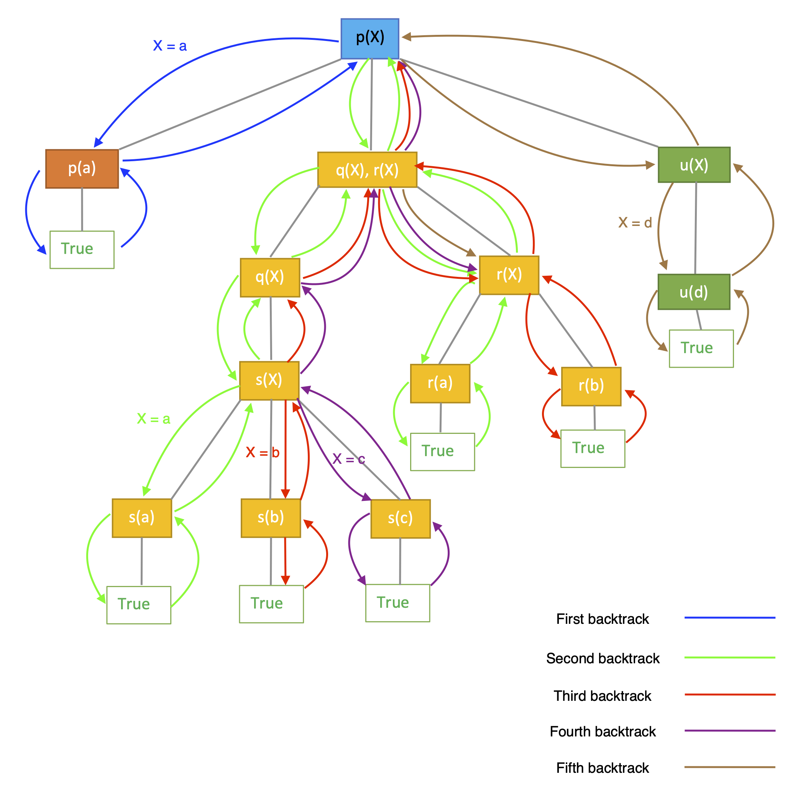

# Prolog
## Installation
- You can use [this](https://www.swi-prolog.org/download/stable) website to download Prolog. Or in Mac OS, open terminal and type this command:
	```bash
	brew install swi-prolog 
	```
- Once installed, type `swipl` in your terminal to use Prolog interpreter.
- You can also write a file by using `.pl` extension. After named Prolog source file, open the interpreter and type this:
	```prolog
	?- [file_name].
	```
- This will state all clauses you defined into the database. If you wish to exit the Prolog interpreter, type `halt.`.
	- Alternatively, the source file could be stated via command line arguments:
	```bash
	swipl file_name.pl
	```
- If you prefer to use an online interpreter, please check it [here](https://swish.swi-prolog.org/).

## [Data types](https://en.wikipedia.org/wiki/Prolog_syntax_and_semantics#Data_types) in Prolog
Prolog is dynamically typed. It only contains one single datatype --- term.
### Kinds of term
- Atom: a single data item. It could be a symbol (represented by lowercase characters), any characters in quotes or special characters.
    - E.g. `x`, `'Taco'`, `+-*/<>`, etc.
- Number: it could be integers or floats.
    - E.g. `1`, `2.0`
- Variable: it is a string beginning with an upper-case letter. It may follow by some letters, numbers and underscores.
    - E.g. `X`, `My_name`, etc.
- [Functor](http://www.cse.unsw.edu.au/~billw/dictionaries/prolog/functor.html): an atom groups a number of arguments.
	- Argument: it is a term the appear between the parentheses.
	- For instance: `a(b,c)` is a functor with name `a` and two arguments `b`, `c`.
    - More examples: `likes(mary, jack)`, `lover(likes(mary, jack), likes(jack, mary))`etc.
- Structure (predicate or compound term) --- Functors with a number of arguments. Concretely, a compound term is composed of some functors.
	- Structures may be nested.
    - E.g. `isList([])`, `s(fst(curry), snd(fst(nested), snd(>o<)))`, etc.
- Special compound terms:
    - List: 
	    - `[]` represents an empty list, 
	    - `[1 | [2 | [3 | []]]]` = `[1,2,3]`.
	 - Strings: 
	 	- `""` represents an empty string.
- More details about the terminology in Prolog could be found [here](https://www.swi-prolog.org/pldoc/man?section=glossary).
### Operation
- Arithmetic operators: 
	- They only operates on [expressions](https://www.swi-prolog.org/pldoc/man?section=clpqr-arg-syntax).
	- Basic: `+`, `-`, `*`, `/`..
	- Numeric comparison operators:
		- The following operators must evaluate their arguments:
			- `<`, `>`, `=\=`(not equal), `=<`, `>=`, `=:=` (equal)
		- The result is `true` if the numeric values of expressions satisfy the comparison.
		- For example:
		```prolog
		?- 1 =< 2.
		true.
		?- min(3,2) < 3.
		true.
		```
- Some speical operators:
	- `is`: it is a built-in predicates that forces the evaluation of right hand expression and binds the evaluated result from the right to the left expression.
		- It works only if the right expression could be evaluated. If you just query `X is X + 1` and there is no reference for `X`, it won't work.
		```prolog
		?- X is min(3, 2) + 5.
		X = 7.
		?- X = 1, Y is X + 1.
		X = 1,
		Y = 2.
		```
	- `=`: unify left expr with right expr.
		- Please check unification for more details.
	- One example shows the difference between `=` and `is`:
		```prolog
		?- 2 is 1 + 1.
		true.
		?- 2 = 1 + 1.
		false.
		```

## Prolog programs
- A Prolog programs consists of a number of clauses.

### Clause
- Def. a unit of information in a Prolog program ending with (".")
    
#### Format
- There are two types of forms to represent a clause:
	```prolog
	Head. % Head is true
	Head :- Body.
	/* Head is true if Body is true. */
	```
- For instance:
	```prolog
	isList([]). /*Fact*/
	isList([_|T]):-isList(T). % Rule
	```

#### Fact, Rule and Goal
- Fact: a clause with empty body. An example of a fact is:
	```prolog
	brother(timmy, tommy).
	/* is equivalent to the rule */
	brother(timmy, tommy) :- true.
	```
- Rule: a clause uses logical implication (`:-`) to describe a relationship among facts.
	- `:-`: interpret it as "if".
		```prolog
		fun(X, Y):- sub_1(X), sub_2(Y).
		/* A query satisfies goal fun if that query could both satisfy subgoals sub_1 and sub_2 */
		```
- Goal in a rule: based on the lecture's definition, a goal in the rule is the head of the rule.
	- Subgoal: it is a goal in the body of the rule.
	- Operations on goals
		- Conjunction (logical and, `∧`): separating the subgoals by commas.
	        ```prolog
	        computer(X):- hasHardware(X), hasSoftware(X).
	        /* X is a computer if it contains hardware and software. */
	        ```
		- Disjunction (logical or, `∨`): separating the subgoals by semicolons or defining by separated clauses.
	        ```prolog
	        weather(X):- isSunny(X).
	        weather(X):- isRainy(X).
	        /* weather X is either sunny or rainy. */
	        ```
### Prolog interpreter
- After loading a program, we can ask Prolog to consult the program via a query.
- Goal in a query: it something that the interpreter tries to satisfy.
	- It is either an atom or a structure. 
	- A goal succeeds (true) if all variables in the terms have a binding and succeed to prove the goal based on defined facts, rules and logic operations. It fails if Prolog fails to prove it.
	- Operations on goals
		- Conjunction (logical and, `∧`): separating the goals by commas.
	        ```prolog
	        ?- likes(X, mary), likes(X, sue).
	        /* return X's binding that X likes mary and sue. */
	        ```
		- Disjunction (logical or, `∨`): separating the goals by semicolons.
	        ```prolog
	        ?- isSunny(X); isRainy(X).
	        /* return X's binding that X is either sunny or rainy. */
	        ```
- Query: a list of one or more goals typed to the interpreter.
- For instance,
	```prolog
	?- isList([1,2,3]). % Query
	true.
	?- [user]. % Allow user to state facts and rules
	|: likes(john,mary).
	|: likes(john,sue).
	|: ^D% user://1 compiled 0.00 sec, 2 clauses
	true.
	
	?- likes(john, X).
	X = mary ;
	X = sue.
	?- likes(X, mary), likes(X, sue).
	X = john.
	```

### Procedure
- Def. A procedure in Prolog is a group of clauses about the same relation. For example,
	```prolog
	mem(X,[X|_]).
	mem(X,[_|T]):-mem(X, T).
	```

#### Evaluation Rules
- Variable
    - Variables appearing in the goal are universally quantified.
    - Variables appearing only in the subgoal are existentially quantified.
    ```prolog
    fun(X, Y):- sub_1(X, Z), sub_2(Z,Y).
    /* ∀ X,Y. ∃ Z. if these variables satisfy the rule fun, they must satisfy subgoal sub_1(X, Z) and sub_2(Z,Y). */
    ```
- Resolution in Prolog [Option]
    - The resolution principle in Prolog describes that if there exists clauses `C1` and `C2` and the head of `C1` matches one of the terms in the body of `C2`, then we replace the term in `C2` with the body of `C1`.
    - For instacne, consider the following clauses:
	    ```prolog
	    takes(frank, csci2020).
	    takes(allen, csci2020).
	    
	    classmates(X, Y) :- takes(X, Z), takes(Y, Z).
	    ```
    - If we let `X` be `frank` and `Y` be `allen`, the head `takes(frank, csci2020)` matches the term `takes(X, Z)` in the body of `classmates`. Thus, based on the principle, we can replace the the term `takes(X, Z)` with the body `takes(frank, csci2020)`.
    - Therefore, the reasoning goes like this:
	    ```
	    ?- classmates(X, Y)
	    > classmates(X, Y) :- takes(X, Z), takes(Y, Z).
	    > classmates(frank, Y) :- takes(frank, csci2020), takes(Y, csci2020). % match the principle, fix bindings by unification
	    > classmates(frank, Y) :- takes(Y, csci2020). % replace term because takes(frank, csci2020) is a fact whose body is true
	    ... % Keep resolve until all results returns.
	    ```
	    - In other words, we are going to resolve the two given clauses and get a new (inferred) clause. 
	 - In general, the reolution in logic could be found [here](https://en.wikipedia.org/wiki/Resolution_(logic)).
- **Unification**
    - Def. the process to solve equations between two terms.
    - Algorithm: given two terms `t1` and `t2` which are to be unified
        - If `t1` and `t2` are constants, they must be identical to successfully unify, otherwise fails.
            - `2 = 2` will be evaluated as true due to two identical atoms unify.
        - If `t1` is variable, then instantiate `t1` to `t2`.
            - `X = 2` will let `X` binds to value `2` because `X` unifies with `2`.
        - If `t2` is variable, then instantiate `t2` to `t1`.
        - If `t1` and `t2` are structures with the same number of arguments, they could unify success iff they have identical functor and recursively unify success for each pair of arguments from the same position.
            - `foo(f(c,d), k(r)) = foo(f(c,d), k(r))` will be evaluated as true because two terms are identical.
            - `foo(a,Y) = foo(X,b)` could be true iff `X = a, Y = b`
        - Otherwise, fails to unify.
    - Occurs Check: 
        - Def. a process to ensure that a variable isn't bound to a structure that contains itself.
        - Concretely, that means an unification of a variable V and a structure S fails if S contains V.
        - In Prolog, we avoid occurs check, which can lead to unsoundness.
            - `X = f(X)` will unify success.
        - However, in SML, we could not define a function with cyclic program structure:
        ```sml
        fun hungry (x: int) = hungry; (* hungry(x) = hungry *)
		 (*
		 Error: right-hand-side of clause doesn't agree with function result type [circularity]
		   expression:  int -> 'Z
		   result type:  'Z
		   in declaration:
		     hungry = (fn x : int => hungry)
		 *)
        ```

**Question: How unification works?**
- Consider this query:
	```prolog
	?- pl_teach(
	   programming_language, semester(Semester), 
	   professor(given('Cory'), SurenameTerm)) 
	   = pl_teach(
	   What, semester('Spring 20'), 
	   professor(given('Cory'), surname('Plock'))).
	```
- Q: For each variable, what does it bind to?
	<details><summary>Solution</summary>
	<p>
		
	```prolog
	Semester = 'Spring 20',
	SurenameTerm = surname('Plock'),
	What = programming_language.
	```
	</p></details>
	
- Pattern matching for a list:
	- Binds all elements in a list
		```prolog
		?- [X, Y, Z] = [1, 2, 3].
		X = 1,
		Y = 2,
		Z = 3.
		```
	- Seperates head and tail for a list
		```prolog
		?- [ X | Y ] = [a, b, c].
		X = a,
		Y = [b, c].
		```
	- Binds multiple elements in a list
		```prolog
		?- [ X, Y | Z ] = [a, b, c].
		X = a,
		Y = b,
		Z = [c].
		```

### Execution Order
- **Back tracking**: given a goal (query) with some rules, backtracking is a way to backtrace and find all possible solutions that satisfy all subgoals.
    - The interpreter tries to match facts and rules by **the order of their definition**.
    - If a subgoal cannot be satisfied, Prolog will try another way.
    - Consider this example, we check if an item exists in list or not:
    ```prolog
    mem(X,[X|_]).
    mem(X,[_|T]):-mem(X, T).
    ```
    - By using the backtracking mechanism, we could find all possible solutions:
    ```prolog
    ?-  mem(1,[2,3,1,1]).
    true ;
    true ;
    false.
    ```
- **Cut Operator**: a way to stop backtacking (avoid redo)
    ```prolog
    mem_noback(X,[X|_]):- !.
    mem_noback(X,[_|T]):-mem_noback(X, T).
    ```
   - By using this rule, we only consider the first fact that satisfy the goal:
    ```prolog
    ?- mem_noback(X,[1,2,3]).
    X = 1.
    ?- mem_noback(1,[1,1,1]).
    true.
    ```
- **Negation**: a way to negate the subgoal.
	- The meaning of negation is not provable. It menas that the given term can't be proven true.
    ```prolog
    ?- \+ (2 = 4).
    true.
    ?- not(mem(b, [a,c,d])). % could not prove b is a member of list [a,c,d]?
    true.
    ```
	- The [negation as failure](https://en.wikipedia.org/wiki/Negation_as_failure) depends on the completeness of the universe of facts.
	```prolog
	dog(a).
	dog(b).
	
	cat(c).
	
	is_dog(X):- dog(X).
	
	is_cat(X):- \+ is_dog(X).
	```
	- However, when you query `is_cat(d)`, the result is also true. The reason cause by this is that the given goal `is_dog(d)` cannot be proven true, but we should expect the rule only works in the universe of `a,b,c`.
	- Thus, the `is_cat` works only if the universe of dog fact is complete. Otherwise, we should define the universe of `cat` fact at first, and define clause `is_cat(X):- cat(X).`
- **Q: How backtracking works?**
	- Consider this example:
		```prolog
		/* Define p */
		p(a).
		p(X) :- q(X), r(X).
		p(X) :- u(X).
		
		/* Define q */
		q(X) :- s(X).
		
		/* Define r */
		r(a). 
		r(b). 
		
		/* Define s */
		s(a).  
		s(b). 
		s(c). 
		
		/* Define u */
		u(d). 
		```
	- We may uses a proof tree to visualize how a query works in Prolog. 
		- The edges in the proof tree may be labeled with some bindings. 
		- The subtree under any goals in the proof tree correspond to different choices. 
		- The leaf represents the finalize choice is correct or not.
	- By backtracking and unification, the real process looks like a preorder traversing of the given proof tree. 
	- When we query `p(X).`, how to represent the execution order by the proof tree?
		<p align="center">
		
		</p>
	- To check backtracking in Prolog, you should open the `trace.` mode to observe the behavior based on your query.
    - Once you have done, type `nodebug.` to exit the trace mode.

## Exercise
1. Implement a rule `append` to concatenate two lists:
	```prolog
	?- append([4],[1,2],X).
	X = [4,1,2].
	?- append([],[1],X).
	X = [1].
	?- append([1],[],X).
	X = [1].
	?- append([],[],X).
	X = [].
	```
	<details><summary>Solution</summary>
	<p>
		
	Here is one possible solution:
	```prolog
	apd([], L, L).
	apd([X|T], L, [X|Rs]):- apd(T, L, Rs).
	```
	</p></details>
2. Is there any problem from previous sample solution?
	<details><summary>Solution</summary>
	<p>
		
	The second argument of `append` may not be a list.
	```prolog
	?- append([],12,12).
	true.
	```
	Thus, we could add one subgoal to the first clause, which ensures that the second argument is a list:
	```prolog
	append([], L, L):-isList(L).
	append([X|T], L, [X|Rs]):- append(T, L, Rs).
	```
	</p></details>
3. Implement a rule `palindrome` to determine if a list is a palindrome:
	```prolog
	?- palindrome([]).
	true.
	?- palindrome([1]).
	true.
	?- palindrome([1,2,1]).
	true.
	?- palindrome([1,2,3]).
	false.
	```
**Answer:** Please find [`prolog1.pl`](https://github.com/LinerSu/nyu-pl-spring-20-rec/blob/master/Week%2013/prolog1.pl) for more details.

4. Implement a rule `subset` which takes two sets and checks either the first set is a subset of second one. 
	```prolog
	?- subset([3,2],[1,2,3]).
	true.
	?- subset([3,4],[1,2,3]).
	false.
	?- subset([],[1,2,3]).
	true.
	```
**Answer:** Please find [`prolog1.pl`](https://github.com/LinerSu/nyu-pl-spring-20-rec/blob/master/Week%2013/prolog1.pl) for more details.

### Note
- There is another [tutorial](http://www.cse.unsw.edu.au/~billw/cs9414/notes/prolog/intro.html) to learn Prolog. Take a look if you want to.
- The idea to design a procedure is very similar to write a pattern matching in functional language. You should consider several cases (patterns) for arguments and add subgoals to fulfill each case if necessary.
- Using cut operator or negate operator is very helpful for your implementation.
