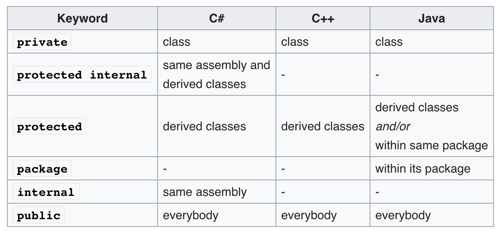

# Object-oriented programming
- Def. a programming paradigm based on the concept of "objects".
- Difference between OOP and OBP: Object-based programming does not support inheritance or subtyping.

## Class-based OOP
### Class
- Def. class is always viewed as a template ('blueprint') to create objects.
- Components
    - Data, in the form of fields, often known as attributes.
    - Code, in the form of procedures, often known as methods.    
- Special methods
	- Constructor: a method for object's initilization.
		- [Java](https://beginnersbook.com/2013/03/constructors-in-java/)
			- No-argument constructor: constructor without any parameters.
				- If you don't define any constructor, the Java compiler will insert a default, no-argument constructor for you.
			- Parameterized constructor: constructor with some parameters.
			- Java allows constructor overloading. You may define multiple constructors with different signatures.
		- [C++](https://www.geeksforgeeks.org/constructors-c/)
			- No-argument constructor
			- Parameterized constructor
			- C++ also allows constructor overloading.
			- [Copy constructor](https://en.wikipedia.org/wiki/Copy_constructor_(C%2B%2B)): a constructor is used for creating a new object by copying the data from an existing object.
				- Used whenever the compiler automatically creates a copy of an instance
				- More details could be found in [here](https://www.geeksforgeeks.org/copy-constructor-in-cpp/).
	- [Destructor](https://en.wikipedia.org/wiki/Destructor_(computer_programming)): a method for object's deletion.
- Let's take a look at this C++ example:
	```c++
	class Point {
	public:
	  Point(double fst, double snd) { // Constructor
	      this->first = fst;
	      this->second = snd;
	  }
	  void print () { // Method
	      cout<<"("<<first<<", "<<second<<")"<<endl;
	  } 
	  ~ Point() { } // Destructor
	private:
	  double first; // Attribute
	  double second;
	};
	```
### Information hiding (Encapsulation)
- Def. a machanism for restricting direct access to some of object's components.
- Common access modifiers: private, protected and public.
- Table for the access modifier:
<p align="center">

</p>

### Object for a class
- Def. a particular instance of a class, where the object can be a combination of variables, functions, and data structures.
- Object allocation
	- In Java, all objects are dynamically allocated on the heap.
	- In C++, local variable (including object) is allocated on the stack. Any objects created by using operator `new` are allocated on the heap.
- Special objects
	- [Singleton object](https://en.wikipedia.org/wiki/Singleton_pattern): an object is a class that has exactly one instance
		- Singleton Class in Java, object in Scala and Kotlin
	- [Companion object]: An object with the same name as a class
		- Usage: easily declare factory methods
		- Available in Scala and Kotlin

## Inheritance and Subtype Polymorphism

### Inheritance
- Def. a mechanism to derive a class (i.e. subclass) from another class (i.e. superclass) for a hierarchy of classes that share a set of attributes and methods.
- Inheritance rule
    - Data, all attributes from superclass will be inherited by the subclass.
    	- Question: why does inheritance care about the private data?
    - Code, depends on what type of methods you have in the superclass. For example, for non-static method:
        - Private method will not be inherited.
        - Other methods will be inherited to subclass.
        - The rules for inheritance might differ. Please check the following links for more detals:
		- [C++](https://www.tutorialspoint.com/cplusplus/cpp_inheritance)
		- [Java](https://www.codejava.net/java-core/the-java-language/12-rules-of-overriding-in-java-you-should-know)
- Example for C++:
	```c++
	class A {
	void method_1() {...}
	void method_2() {...}
	};
	class B: public A { // class B publicly inherits class A, B <- A
	// Implicitly inherits method_1 from class A
	void method_2() {...} // method_2 has been overridden
	void method_3() {...} // New methods just for class B
	};
	// B is subclass of A, A is superclass of B.
	```
- Variants (`<-`, inherits)
    - Single inheritance: `B <- A`
    - Multiple inheritance: `C <- A`, `C <- B`
    - Multilevel inheritance: `C <- B <- A`
- [(Liskov) Substitution Principle](https://en.wikipedia.org/wiki/Liskov_substitution_principle)
    - The type of a subclass can extend the type of its superclass by adding new members (attributes and methods).
        - e.g. `method_3` in class `B`.
    - Objects of superclass may be replaced with objects of subclass
    	- That means, objects that belong to the subclass can be used whenever an object of the superclass is expected.
        - Due to inheritance features, object for subclass is safe to assign / pass to variable declared as superclass type.
            - `A *a = new B()`
        - The reason why dynamic dispatch could be achieved.
### Overriding methods (Polymorphism)
- Def. a feature that allows a subclass or child class to provide a specific implementation of a method that is already provided by one of its superclasses or parent classes.
    - For example, when you have an object `B b`, `b.method_1()` allowed.

### Static vs. Dynamic Types
- Static type: the type that the compiler infers or programmer declares for that expression at **compile-time**.
- Dynamic type: the actual type of the value obtained when the expression is evaluated at **run-time**.
- Consider the following Java example:
	```Java
	class A{
	  A() { x = 0; z = 0;}
	  public int m() { return x; }
	  public int x;
	  private int z;
	}

	class B extends A {
	  B() { x = 1; y = 2;}
	  @Override
	  public int m() { return x + y;}
	  public int y;
	}

	class Main {
	  public static void main(String[] args) {
	    A a = new B(); // static: A, dynamic: B
	    // int z = a.y; // Not allowed
	    System.out.printf("The result of m should be: %d\n", a.m()); // actual call method m in class B
	    A act_a = new A(); // sizeof(act_a) == sizeof(a)? No!
	    // instanceof checks if a given object is an instance of a given class, superclass or interface
	    System.out.println(act_a instanceof A == a instanceof A); // true
	    System.out.println(act_a instanceof B == a instanceof B); // false
	  }
	}
	```
	- When the compiler executes `A a = new B();`, the static type for object `a` is `A`, which means object `a` could **only call** non-private methods of class `A`. However, the dynamic type for variable `a` is `B` and it will be allocated as a `B` instance (object). That is, the size for object `a` is the same size as an object for class `B`. 

### Dynamic dispatch
- Def. the process of selecting which implementation of a polymorphic operation to call at the run time.
- [Virtual method](https://en.wikipedia.org/wiki/Virtual_function): is a method that helps in run-time polymorphism.
	- It is a method to enable dynamic dispatch!
- Variants **[Very Importent]!!!**
    - In Java, every non-static method, except final and private method, is virtual by default.
        - The methods which cannot be inherited for polymorphic behavior is not a virtual method.
    - In C++, method calls via pointers (or references) to a base type can not be dispatched at compile time, the dynamic dispatch is used through [virtual function](https://www.geeksforgeeks.org/virtual-function-cpp/).
- [Static dispatch](https://en.wikipedia.org/wiki/Static_dispatch): a form of polymorphism fully resolved during the compile time.
    - In C++, it is used for non-virtual function's call by object's pointer/reference or method call from stack based / static object.
    - In Java, it is used for static methods or methods with final or private keyword.
    - At compile time, these methods' call are the same as normal functions' call.
- Object data layout in memory
    - Each object's layout is determined by its dynamic type.
    - Data layout contains attributes (data members) for each instance of a class.
    - They are order by the declaration.
    - Each data member can be accessed via a fixed offset from the base address of the data layout.
    - Subclass objects have the same memory layout as superclass objects with additional space for the subclass members that succeeds the space for the superclass members.
    - For example, here are the data layouts for objects `a` and `act_a`:
    ```diff
    !Objects' data layouts in memory

    A Instance (act_a):
        ┌─────────────┐
        │    x = 0    │
        ├─────────────┤> members of A
        │    z = 0    │
        └─────────────┘
    B Instance (a):
        ┌─────────────┐
        │    x = 1    │
        ├─────────────┤> members of A
        │    z = 0    │
        ├═════════════┤
        │    y = 2    │> additional members of B
        └─────────────┘
    ```

#### [Virtual method Table](https://en.wikipedia.org/wiki/Virtual_method_table) (Vtable)
- Def. each class has its own vtable which is shared by all instances of that class.
    - A way to store the virtual method's pointer for each class.
    - Inside this table, it contains an array of pointers to functions that implement the virtual methods of the class.
    - Pointers to methods are order by declaration.
    - **Note that**, the implementation of vtable is based on class. Each object is a "user" of vtable.
- The data layout could access vtable by adding one member called virtual pointer.
	- When an instance is created, the vpointer of that instance will be set to the corresponded vtable.
	- If there exisits a call for virtual method, the run-time system looks up the vtable of the instance via the vpointer, then calls that method through the function pointer in vtable.
- Inheritance:
    - A vtable for subclass is created by copying the vtable from superclass and changing any pointers of overridden (virtual) methods to the new implementations.
- For example, here are the memory map for objects `a` and `act_a`:
	```diff
	    Objects' memory map in memory

	    A Instance (act_a):             A vtable:
		┌─────────────┐        ┌──>┌────────────┐                    ┌─────────────┐
		│ vptr        │────────┘   │ ptr. to m  │───────────────────>│impl. of A.m │
		├─────────────┤            └────────────┘                    └─────────────┘
		│    x = 0    │
		├─────────────┤
		│    z = 0    │
		└─────────────┘
	    B Instance (a):                 B vtable: 
		┌─────────────┐        ┌──>┌────────────┐                    ┌─────────────┐
		│ vptr        │────────┘   │ ptr. to m  │───────────────────>│impl. of B.m │
		├─────────────┤            └────────────┘                    └─────────────┘
		│    x = 1    │
		├─────────────┤
		│    z = 0    │
		├═════════════┤
		│    y = 2    │
		└─────────────┘
	```

**Example**
1. Consider the following C++ code:
```c++
#include <iostream>

using namespace std;
class CLASSA {
public:
    virtual void function_f () {}
    void function_g() {}
};

int main()
{
    CLASSA local_a;		// stack object
    local_a.function_f();	// callq	__ZN6CLASSA10function_fEv, normal method call
    local_a.function_g();	// callq	__ZN6CLASSA10function_gEv, normal method call
    CLASSA *dyn_a = new CLASSA(); // heap object
    dyn_a->function_f();	// callq	*(%rdx), use vtable
    dyn_a->function_g();	// callq	__ZN6CLASSA10function_gEv, normal method call
    CLASSA *ptr_a = &local_a;
    ptr_a->function_f();	// callq	*(%rdx), use vtable
    ptr_a->function_g();	// callq	__ZN6CLASSA10function_gEv, normal method call
    return 0;
}
```
- Q: Draw the vtable for class `CLASSA`.
	```
	CLASSA's vTable
	+------------------+
	|ptr. to function_f|─────────────┐
	+------------------+             |
	                                 |
	+--------------------------+     |
	|impl. of CLASSA.function_f|<────┘
	+--------------------------+

	vtable inside assembly code
	__ZTV6CLASSA: # Vtable for CLASSA
		.quad	0
		.quad	__ZTI6CLASSA
		.quad	__ZN6CLASSA10function_fEv
	```
- Q: Inside the `main` function, which method's call uses vtable?
	```
	dyn_a->function_f();
	ptr_a->function_f();
	```
<details><summary>Reasoning</summary>
<p>
	
In C++, you may use either an object instance (i.e. `local_a`) or an object pointer/reference (i.e. `dyn_a` or `ptr_a`). But there are some differences for the method's call. 

During the compliation, for each method call of an instance will be translated as a normal function call. Thus, `local_a.function_f()` and `local_a.function_g()` will not use `CLASSA`'s vtable even if `function_f` is a virtual method.
For object pointer/reference, the method call will depend on virtual or non-virtual method. For any virtual methods' call by an object pointer/reference, it uses `CLASSA`'s vtable. For non-virtual method's call, the compiler treats it as a normal function call.

Therefore, to distinguish the method call for vtable, you just check that either the call is created by an object pointer or by an instance.

You can also check the assembly code [`locobj.s`](https://github.com/LinerSu/nyu-pl-spring-20-rec/blob/master/Week%2014/locobj.s) to see the differences.
</p></details>

**Exercise**

Consider the following Java code:
```java
class A {
    private A m1(){
      System.out.println("A.m1()");
      return new A();
    }
    public void m2(){
      System.out.println("A.m2()");
    }
    public A m3() {
      System.out.println("A.m3()");
      return this;
    }
    public A m4() {
      return this.m1();
    }
  }
  
  class B extends A {
    private B m1(){
      System.out.println("B.m1()");
      return new B();
    }
    
    @Override
    public void m2() {
      System.out.println("B.m2()");
    }
  }

class Main {
  public static void main(String[] args) {
    A a1 = new B();

    A a2 = a1.m4();

    a2.m2();

    A a3 = a1.m3();

    a3.m2();
  }
}
```
1. What are the static and dynamic types of `a1`, `a2` and `a3`?
2. What methods are the call `a2.m2()`, `a1.m3()` and `a3.m2()` dispatched to?

<details><summary>Solution</summary>
<p>

Draw the memory map for each object:
```
                                                                        +-------------+
        B instance                B's vtable                        ┌──>|impl. of B.m2|
a1 ───┌>+----------+            ┌>+-------------+                   |   +-------------+ 
a3 ───┘ | vptr ----|------------┘ |ptr. to m2 --|───────────────────┘   +-------------+
        |==========|              |ptr. to m3 --|───────────────┌──────>|impl. of A.m3|                  
        +----------+              |ptr. to m4 --|────────┐      |       +-------------+
                                  +-------------+        |      | 
                                                         └──────|───┌──>+-------------+
                                                                |   |   |impl. of A.m4|
                                                                |   |   +-------------+
                                                                |   |
                                                                |   |
        A instance                A's vtable                    |   |
a2 ───> +----------+            ┌>+-------------+               |   |    +-------------+   
        | vptr ----|------------┘ |ptr. to m2 --|───────────────|───|───>|impl. of A.m2|   
        |==========|              |ptr. to m3 --|───────────────┘   |    +-------------+        
        +----------+              |ptr. to m4 --|───────────────────┘
                                  +-------------+
```
- Answer for Q1: 
	- To determine dynamic type, we check the actual instance pointed for each object.
	- To determine static type, we check the type for each object in the code.
	- `a1`:
		- Static type: `A`
		- Dynamic Type: `B`
	- `a2`: 
		- Static type: `A`
		- Dynamic Type: `A`
	- `a3`: 
		- Static type: `A`
		- Dynamic Type: `B`

- Answer for Q2: 
	- To determine dynamic dispatch, we check each object's instance, and look up the virtual table.
	- call for `a2.m2()` is dispatched to `A.m2`
	- call for `a1.m3()` is dispatched to `A.m3`
	- call for `a3.m2()` is dispatched to `B.m2`

</p></details>

## Prototype-based OOP
- Def. Object is not related to class. It could be created as an empty object or cloned from an existing object (prototype object).
- Objects inherit directly from other objects through a prototype property.
    - `__proto__` in JavaScript.
- Cloning (inheritance) is performed by behaviour reuse.
    - A process of reusing existing objects via delegation that serve as prototypes.
        - Delegation: refers to evaluating a member (property or method) of one object in the context of another original object.
- Consider the following JavaScript codes:
	```js
	var foo = {one: 1, two: 2};
	var bar = Object.create( foo ); // bar = clone(foo)
	bar.one; // return 1, bar refers foo.a
	bar.three = 3; // add new field
	bar.two = "this is two"; // add new field two, and shadow proto object's two
	print(bar.two);
	bar;
	/*
	three: 3
	two: "this is two"
	__proto__:
	    name: "foo"
	    one: 1
	    two: 2
	*/
	```
- The memory map for objects `foo` and `bar` are:
<p align="center">
  
</p>

## Note
1. There is one great [explanation](https://stackoverflow.com/a/34462741/4608339) of static/dynamic dispatch in C++. Take a look if you still confused with the difference.
