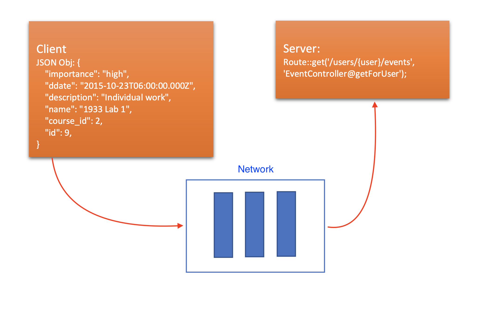

# Concurrent Programming
- Def. it is a programming paradigm that supports program concurrency. Programming languages 
- Concurrent programs actions that may be performed simultaneously.
- Where do we use concurrency?
	- Web server, Cloud computing, , etc.
- Is parallel programming? Not simply!
	- In a single processor environment, concurrency apears to interleaved execution of concurrent activities. (i.e. Multithreading)
	- In multiple processor case, concurrenct is a result of overlapped execution of concurrent activities. (e.g. Multiprocessing)
- Types
	- Multi-core programming: with multicore processor and multiprocessor system, this programming paradigm helps developer to utilize the large number of cores. The processors may have access to a shared memory.
		- Shared memory
			- Def. 
			- This happens when: 
				- Two processors share the same physical memory.
				- Two programs share the same memory.
				- Two threads share the same data.
			- E.g.
			<p align="center">
			  
			</p>
	- Distributed programming: this is designed for execution on a network autonomous processors that do not share main memory (each of them has its own private memory).
		- Message Passing
			- Def.
			- This happens when:
				- Two computers communicating in a network
				- Client and server
				- Two programs has been connected by a pipe
			- For instance:
			<p align="center">
			  
			</p>
- Issue with sharing memory
	- Race condition: the result depends on a sequence of events that are out of control. This may cause bug (undetermined results) when events do not work as we intended.
		- For instance, suppose we have two threads share a variable `x`:
		```python
		# Suppose variable x and y are initialized to 0.
		T1: x = x + 1		|  T2: y = x
		```
		- What is the value of `y`? If thread `T1` goes first, then `y` will be `1`, but if `T2` executes first, then `y` does not change its value.
	- Deadlock situation: it happend when a process or thread holds a resource and waits for another resource held by another waiting process. However, the waiting process state forevers because each requested resource is used by another process.
		- For example:
			<p align="center">
			  
			</p>
		- Picture from a lecture - [Concurrent Programming](https://github.com/nyu-pl-fa18/class14/blob/master/class14.pdf).
	- Weak memory consistency: the behaviours of accessing memory through multiple processes / threads might be inconsistent. That is, the programmers are responsible for maintaining consistency by using synchronization techniques.
	- Consider this example, suppose we have two threads share variables `x` and `y`:
	```python
	# Suppose variable x and y are initialized to 0.
	T1: x = 1			|  T2: y = 1
		print y		|    	print x
	```
		- What does the program print?
		- It depends on the compiler and hardware optimizations. The behaviours are unpredictable. 
			- For instance, program might print results where `y = 1` and `x = 0`.
			<p align="center">
			  
			</p>
- Mutual exclusion
	- Critical region or section: a resource, memory or variable that only allows one thread to access at a time.
	- Def. it is a situation that one process / thread enters a critical region or section and excludes all other processes / threads until that process / thread is finished.
	- It is introduced for the purpose of preventing race conditions.

## Ada
- Ada is a static typed, obejct-oriented programming langauge.
- Ada program may contain several components:
	- Subprograms: [procedures](https://en.wikibooks.org/wiki/Ada_Programming/Subprograms#Procedures) or [functions](https://en.wikibooks.org/wiki/Ada_Programming/Subprograms#Functions).
		- Type of parameters: `in`, `out`, and `in out`.
	- [Package](https://en.wikibooks.org/wiki/Ada_Programming/Packages): define collection of data and codes. Modularization.
	- [Task](https://en.wikibooks.org/wiki/Ada_Programming/Tasking)
		- Def. like a thread, a task 
		- Task type
		- A Ada task type is very close to Java `Thread` subclass.
- Rendezvous
	- Def. A rendezvous is a process to synchronize two tasks.
	- It works by using `entry` and `accept` statements. The communication from task to task via an `entry` call.

### Example
- Suppose we want to create a program for 5 x 5 matrix (square) multiplication.
- Based on mathematics representation:
	<p align="center">
	  
	</p>
	- We know this multiplication could be done by interleaved (i.e. multi-threaded application). Thus, we could also create an Ada program with task.
	- How many tasks we need? *Same as the array size*.
	- Do we have to synchronize the multiplication? *Yes, because we need a task to dispatch each index of row and colomun to each multiplication task. After the assignment, each task could calculate result independently*.
- Here is a short version of how we write a concurrent multiplication:
```ada
procedure Main is
SIZE: constant Integer := 5; -- 5 x 5 Matrix 
type SquareType is array(1..SIZE,1..SIZE) of Integer;
X,Y,Z: SquareType;
    
    procedure SqrMult(A,B: in SquareType; C: out SquareType) is
      
      procedure Product(Row: Integer; Col: Integer) is
         Sum: Integer := 0;
          begin
             for I in 1..Size loop
                Sum := Sum + (A(Row,I)*B(I,Col));
             end loop;
             C(Row,Col) := Sum;
        end Product;
      
      task type ProductTask is
         entry SetIndex(Row: Integer; Col: Integer);
      end ProductTask;
      
      task body ProductTask is -- code for tasks to execute
         R,C: Integer;
       begin
       	-- Each thread will wait a call for SetIndex
          accept SetIndex(Row: Integer; Col: Integer) do
            -- Assign row and col
            R := Row;
            C := Col;
         end SetIndex;
         -- After executing the body of the accept statement,
         -- the threads will calculate the results independently
         Product(R,C);
      end ProductTask;
      
      -- Once you have tasks in Ada, the compiler starts those threads after compilation
      -- Each thread will execute the body of the task
      MyTasks: array(1..Size,1..Size) of ProductTask;
      
   begin -- SqrMult
     for Row in 1..Size loop
         for Col in 1..Size loop
            MyTasks(Row,Col).SetIndex(Row,Col);
         end loop;
      end loop;
   end SqrMult;

begin
    X:= ((1,2,3,4,5),(1,2,3,4,5),(1,2,3,4,5),(1,2,3,4,5),(1,2,3,4,5));
    Y:= ((1,1,1,1,1),(1,1,1,1,1),(1,1,1,1,1),(1,1,1,1,1),(1,1,1,1,1));
    SqrMult(X,Y,Z); -- Each element is 15
end Main;
```

## Java

```java
class MyThread extends Thread {
   public int element;

   public MyThread (int element){
      this.element = element;
   }

   public void run () {
      System.out.println("The element in "+ 
      getName() +": "+Integer.toString(this.element));
   }
}

public class HelloWorld{

   public static void main (String[] args) {
      MyThread [] tab = new MyThread [10];

      for (int i = 0; i < 9; ++i) {
         tab [i] = new MyThread (i);
         tab [i].start ();
      }
	 // The order of the outputs might be different from the order of creations
   }
}
```

## Python (Option)
- [Future and Promise](https://en.wikipedia.org/wiki/Futures_and_promises#List_of_concepts_related_to_futures_and_promises_by_programming_language)
	- Future: it is a read-only placeholder object for a value may not yet exist.
	- Promise: it is a writable, single assignment container which sets the value of the future (i.e. to make a future complete).
	- In other words, if you promise something, you expect to achieve it in the future.
	- Note that, the concept of a future/promise is not restricted to multithreading (like C++).
	- For instance, in Javascript (Python), future and promise is used to asynchronize I/O:
	```js
	...
	/*
	A simple client code implemented by using AngularJS.
	In JavaScript, we don't talk about "future" :(
	*/
	var deferred = $q.defer(); // Create a deferred object, it contains a promise object
	$http.post(ServerURLs.events,newEvent)
      .success(function(return_id){
        console.log("Event added successfully");
        newActivity.id = return_id;
        syncEventToLocal(newEvent);
        deferred.resolve(newEvent.id); // Resolved the promise, return your defined promise with return value
      })
      .error(function(errorMessage){
        console.log("Failure to add this new event");
        deferred.reject(errorMessage); // Reject the promise, raise an exception to report this error
      });
   ...
	```
	- However, in Python (after Python 3.5), we can use [async IO](https://realpython.com/async-io-python/). This package allows us to implement asynchronous process by using a single thread.
		- Coroutine: it is a function that can suspend its execution before reaching return, and it can indirectly pass control to another coroutine for some time. That is, a function allows you to switch execution.
		- For example, consider the following code (example and picture from Python 3.5 [manual](https://docs.python.org/3.5/library/asyncio-task.html)):
		```python
		import asyncio
		async def compute(x, y):
		    print("Compute %s + %s ..." % (x, y))
		    await asyncio.sleep(1.0) # await <future>, suspends the coroutine compute until asyncio.sleep(1.0) is done
		    return x + y # return a result to the coroutine that is waiting for this one using await or yield from.
		async def print_sum(x, y):
		    result = await compute(x, y) # or yield from <future>, before 3.5
		    print("%s + %s = %s" % (x, y, result))
		loop = asyncio.get_event_loop()
		loop.run_until_complete(print_sum(1, 2))
		loop.close()
		"""
			The output will be:
			Compute 1 + 2 ...
			// sleep 1 second
			1 + 2 = 3
		"""
		```
		- The sequence of scheduling are:
		<p align="center">
		  
		</p>